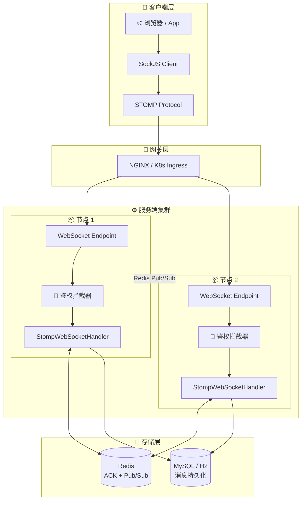
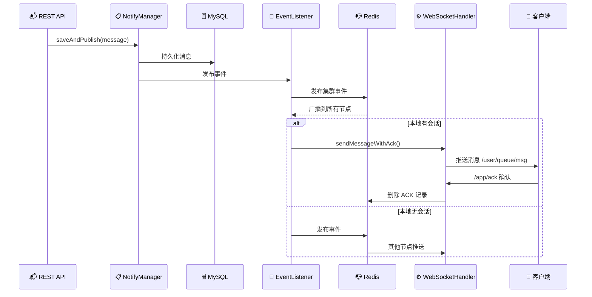
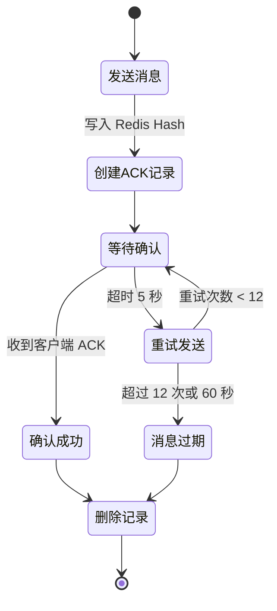

# Quick-Notify

```
██████╗ ███████╗██╗   ██╗    ███████╗ ██████╗██████╗  ██████╗ ███╗   ███╗
██╔══██╗██╔════╝██║   ██║    ██╔════╝██╔════╝██╔══██╗██╔═══██╗████╗ ████║
██████╔╝█████╗  ██║   ██║    █████╗  ██║     ██████╔╝██║   ██║██╔████╔██║
██╔══██╗██╔══╝  ╚██╗ ██╔╝    ██╔══╝  ██║     ██╔══██╗██║   ██║██║╚██╔╝██║
██║  ██║███████╗ ╚████╔╝     ███████╗╚██████╗██║  ██║╚██████╔╝██║ ╚═╝ ██║
╚═╝  ╚═╝╚══════╝  ╚═══╝      ╚══════╝ ╚═════╝╚═╝  ╚═╝ ╚═════╝ ╚═╝     ╚═╝
```

### Enterprise-Grade Real-Time Notification System

[](https://spring.io/projects/spring-boot)
[](https://www.oracle.com/java/)
[](LICENSE)
[](https://github.com/your-repo/quick-notify)

> 基于 **Spring Boot 3 + WebSocket STOMP + Redis** 的企业级实时消息推送系统
> 支持集群部署、消息 ACK 确认、消息持久化，已在**万级日活生产环境**验证

---

## ✨ 特性亮点

| 特性 | 描述 |
|------|------|
| 🚀 **Starter 模式** | 零配置接入，一行依赖即可启用 |
| ⚡ **实时推送** | WebSocket + STOMP 协议，毫秒级消息送达 |
| ✅ **ACK 确认** | 自动重试机制，确保消息可靠送达 |
| 🌐 **集群支持** | 基于 Redis Pub/Sub，多节点水平扩展 |
| 💾 **消息持久化** | 支持历史消息存储与查询 |
| 🔐 **安全认证** | Token 鉴权，每用户最多 10 个连接 |

---

## 📊 性能基准

| 指标 | 数据 |
|------|------|
| 消息延迟 | < 50ms（P99） |
| 单机并发 | 10,000+ WebSocket 连接 |
| 消息吞吐 | 5,000+ msg/s |
| ACK 重试 | 最多 12 次，60 秒 TTL |

---

## 🏗️ 系统架构


```mermaid
graph TB
    subgraph Client [👤 客户端层]
        Browser[🌐 浏览器 / App]
        SockJS[SockJS Client]
        STOMP[STOMP Protocol]
    end

    subgraph Gateway [🚪 网关层]
        Nginx[NGINX / K8s Ingress]
    end

    subgraph Server [⚙️ 服务端集群]
        subgraph Node1 [📦 节点 1]
            WS1[WebSocket Endpoint]
            Handler1[StompWebSocketHandler]
            Interceptor1[🔐 鉴权拦截器]
        end

        subgraph Node2 [📦 节点 2]
            WS2[WebSocket Endpoint]
            Handler2[StompWebSocketHandler]
            Interceptor2[🔐 鉴权拦截器]
        end
    end

    subgraph Storage [💾 存储层]
        Redis[(Redis<br/>ACK + Pub/Sub)]
        MySQL[(MySQL / H2<br/>消息持久化)]
    end

    Browser --> SockJS --> STOMP
    STOMP --> Nginx
    Nginx --> WS1
    Nginx --> WS2

    WS1 --> Interceptor1 --> Handler1
    WS2 --> Interceptor2 --> Handler2

    Handler1 <--> Redis
    Handler2 <--> Redis
    Handler1 --> MySQL
    Handler2 --> MySQL

    Node1 -.-> |Redis Pub/Sub| Node2
```

---

## 🔧 快速开始

### 环境要求

- Java 21+
- Maven 3.8+
- Redis 6+

### 1️⃣ 启动 Redis

```bash
docker run -d --name redis -p 6379:6379 redis
```

### 2️⃣ 一行依赖接入

```xml
<dependency>
    <groupId>io.stu</groupId>
    <artifactId>quick-notify-spring-boot-starter</artifactId>
    <version>0.0.1-SNAPSHOT</version>
</dependency>
```

### 3️⃣ 自动配置完成

```yaml
# application.yml（可选，自定义配置）
spring:
  datasource:
    url: jdbc:h2:mem:quicknotify
  sql:
    init:
      mode: always
      schema-locations: classpath:schema.sql

redisson:
  single-server-config:
    address: redis://127.0.0.1:6379
```

### 4️⃣ 发送消息

```java
@Autowired
private NotifyManager notifyManager;

// 发送通知
NotifyMessageLog message = NotifyMessageLog.builder()
    .receiver("user123")
    .type("ORDER_STATUS")
    .data(orderData)
    .build();

notifyManager.saveAndPublish(message);
```

### 5️⃣ 前端订阅

```javascript
const stompClient = Stomp.over(new SockJS('/stomp-ws'));

stompClient.connect(
    { Authorization: 'Bearer your-token' },
    function(frame) {
        // 订阅个人消息
        stompClient.subscribe('/user/queue/msg', function(message) {
            const data = JSON.parse(message.body);
            console.log('收到消息:', data);

            // 发送 ACK 确认
            stompClient.send('/app/ack', {}, data.id);
        });
    }
);
```

---

## 📡 API 文档

### REST API

| 方法 | 路径 | 说明 |
|------|------|------|
| `POST` | `/vh-stomp-wsend/push_all_obj` | 广播所有用户 |
| `POST` | `/vh-stomp-wsend/push_all_obj/{userId}` | 发送给指定用户 |
| `POST` | `/vh-stomp-wsend/cluster/notify/{userId}` | 集群消息（持久化） |
| `GET` | `/api/notify/history` | 获取历史消息 |
| `POST` | `/api/notify/viewed` | 标记已读 |
| `DELETE` | `/api/notify/delete` | 删除消息 |

### STOMP 路径

| 路径 | 类型 | 说明 |
|------|------|------|
| `/user/queue/msg` | 订阅 | 接收个人消息 |
| `/topic/messages` | 订阅 | 接收广播消息 |
| `/app/sendMessage` | 发送 | 发送消息 |
| `/app/ack` | 发送 | 消息确认 |

---

## 🔄 消息流程


```mermaid
sequenceDiagram
    participant API as 📬 REST API
    participant Manager as 📋 NotifyManager
    participant DB as 🗄️ MySQL
    participant Listener as 📡 EventListener
    participant Redis as 📭 Redis
    participant Handler as ⚙️ WebSocketHandler
    participant Client as 👤 客户端

    API->>Manager: saveAndPublish(message)
    Manager->>DB: 持久化消息
    Manager->>Listener: 发布事件

    Listener->>Redis: 发布集群事件
    Redis-->>Listener: 广播到所有节点

    alt 本地有会话
        Listener->>Handler: sendMessageWithAck()
        Handler->>Client: 推送消息 /user/queue/msg
        Client->>Handler: /app/ack 确认
        Handler->>Redis: 删除 ACK 记录
    else 本地无会话
        Listener->>Redis: 发布事件
        Redis->>Handler: 其他节点推送
    end
```

---

## ⚡ ACK 确认机制


```mermaid
stateDiagram-v2
    [*] --> 发送消息
    发送消息 --> 创建ACK记录: 写入 Redis Hash
    创建ACK记录 --> 等待确认

    等待确认 --> 确认成功: 收到客户端 ACK
    等待确认 --> 重试发送: 超时 5 秒

    确认成功 --> 删除记录
    删除记录 --> [*]

    重试发送 --> 等待确认: 重试次数 < 12
    重试发送 --> 消息过期: 超过 12 次或 60 秒
    消息过期 --> 删除记录
```

**配置参数**：

| 参数 | 默认值 | 说明 |
|------|--------|------|
| `ACK_CHECK_WAIT_MS` | 5000ms | 首次检查等待时间 |
| `ACK_RETRY_INTERVAL_MS` | 5000ms | 重试间隔 |
| `ACK_MESSAGE_TTL_MS` | 60000ms | 消息最大存活时间 |
| `ACK_MAX_RETRY_COUNT` | 12 | 最大重试次数 |

---

## 🔍 与其他方案对比

| 特性 | Quick-Notify | Socket.IO | SSE | MQTT |
|------|--------------|-----------|-----|------|
| 协议 | WebSocket + STOMP | WebSocket | HTTP | TCP/MQTT |
| 集群支持 | ✅ Redis Pub/Sub | ❌ 需适配 | ❌ 不支持 | ✅ Broker |
| 消息确认 | ✅ ACK 机制 | ⚠️ 需配置 | ❌ 不支持 | ✅ QoS |
| Spring 集成 | ✅ 原生 | ⚠️ 社区 | ⚠️ 社区 | ⚠️ 社区 |
| Starter 模式 | ✅ 零配置 | ❌ 手动 | ❌ 手动 | ❌ 手动 |
| 学习成本 | 低 | 中 | 低 | 高 |

---

## 📁 项目结构

```
quick-notify/
├── README.md                        # 本文档
├── LICENSE                          # MIT 许可证
├── img.png                          # 项目截图
│
├── quick-notify-spring-boot-starter/  # 🔧 核心 Starter 模块
│   ├── pom.xml
│   └── src/main/java/io/stu/notify/
│       ├── QuickNotifyAutoConfiguration.java  # 自动配置
│       ├── NotifyManager.java                 # 消息管理器
│       ├── model/
│       │   ├── NotifyMessage.java            # WebSocket 消息 DTO
│       │   └── MessageTypeRegistry.java       # 消息类型注册
│       ├── repository/
│       │   ├── NotifyRepository.java         # 仓储接口
│       │   └── JdbcNotifyRepository.java     # JDBC 实现
│       ├── event/
│       │   ├── NotifyMessageEvent.java       # 消息事件
│       │   └── NotifyEventListener.java      # 事件监听器（集群）
│       └── stomp/
│           ├── StompWebsocketConfig.java      # WebSocket 配置
│           ├── StompWebsocketInterceptor.java # 鉴权拦截器
│           └── StompWebSocketHandler.java     # 消息处理器（ACK）
│
└── quick-notify-example/            # 📚 示例应用
    ├── pom.xml
    └── src/main/
        ├── java/io/stu/example/
        │   ├── ExampleApplication.java
        │   ├── DemoController.java
        │   └── HistoryController.java
        └── resources/
            ├── application.yml
            ├── schema.sql
            └── static/
                └── stomp-websocket-sockjs.html  # WebSocket 测试页面
```

---

## 🧪 运行示例

```bash
# 克隆项目
git clone https://github.com/your-repo/quick-notify.git
cd quick-notify

# 运行示例
mvn spring-boot:run -pl quick-notify-example

# 打开测试页面
open http://localhost:2025/stomp-websocket-sockjs.html

# 发送测试消息
curl -X POST -d "Hello World" http://localhost:2025/vh-stomp-wsend/push_all_obj/test1
```

---

## 📖 文档导航

| 文档 | 说明 |
|------|------|
| [快速入门](./blog/01-quick-start-guide.md) | 5 分钟快速上手 |
| [接入指南](./blog/02-spring-boot-starter-guide.md) | Spring Boot Starter 使用 |
| [协议原理](./blog/03-websocket-stomp-principle.md) | WebSocket STOMP 深入理解 |
| [ACK 设计](./blog/04-ack-reliability-design.md) | 消息确认机制详解 |
| [集群方案](./blog/05-redis-cluster-solution.md) | Redis 集群实现 |
| [生产部署](./blog/07-production-deployment.md) | 生产环境部署 |

完整文档请查看 [blog](./blog/) 目录。

---

## 🤝 贡献

欢迎提交 Issue 和 Pull Request！

1. Fork 本仓库
2. 创建特性分支 (`git checkout -b feature/amazing-feature`)
3. 提交更改 (`git commit -m 'Add amazing feature'`)
4. 推送到分支 (`git push origin feature/amazing-feature`)
5. 创建 Pull Request

---

## 📄 许可证

本项目基于 [MIT License](LICENSE) 开源。

---

## 🔗 链接

- 📘 [项目文档](https://your-docs-url.com)
- 💾 [GitHub 仓库](https://github.com/your-repo/quick-notify)
- 📦 [Maven 中央仓库](https://search.maven.org/)

---

<p align="center">
  <strong>如果对你有帮助，请 star ⭐ 支持一下！</strong>
</p>
