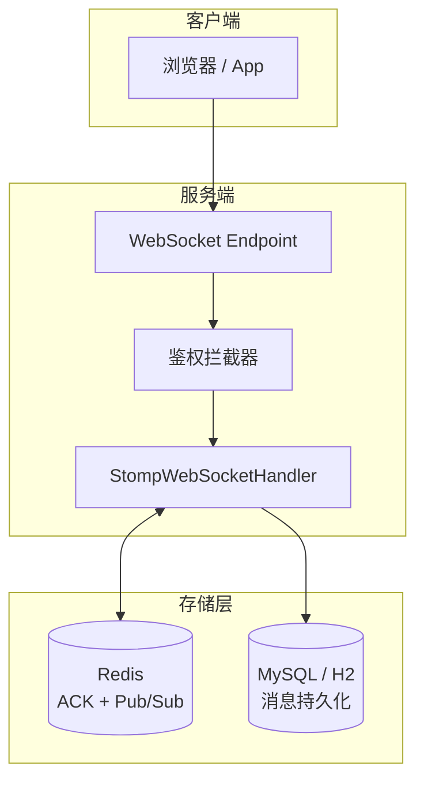
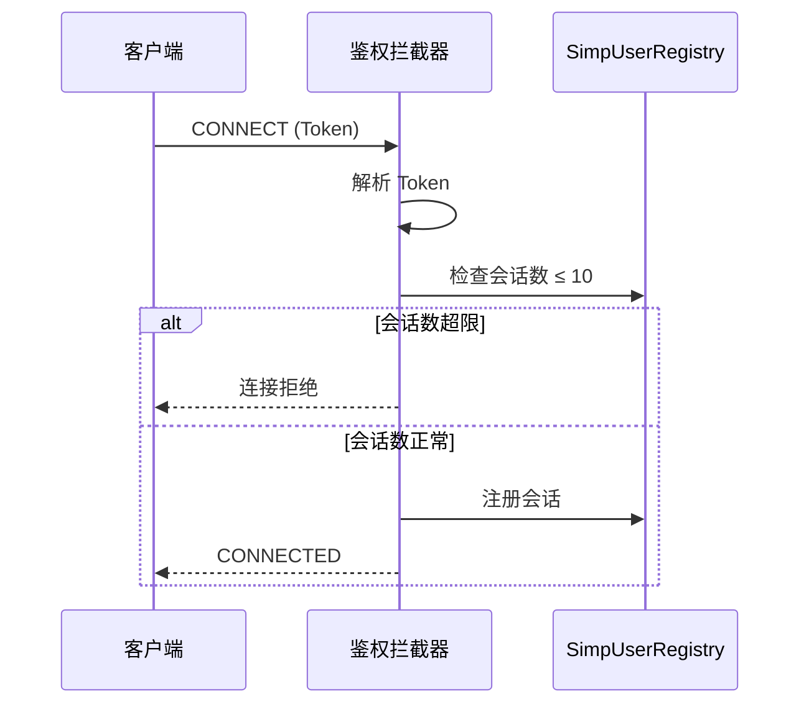
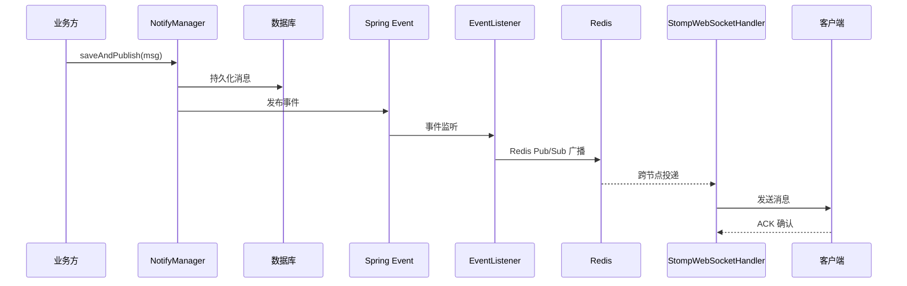
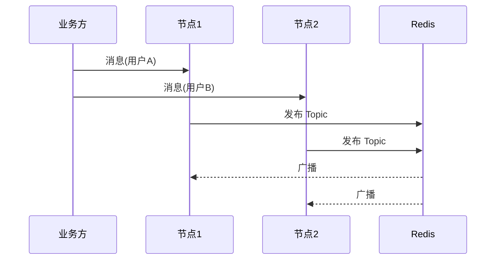
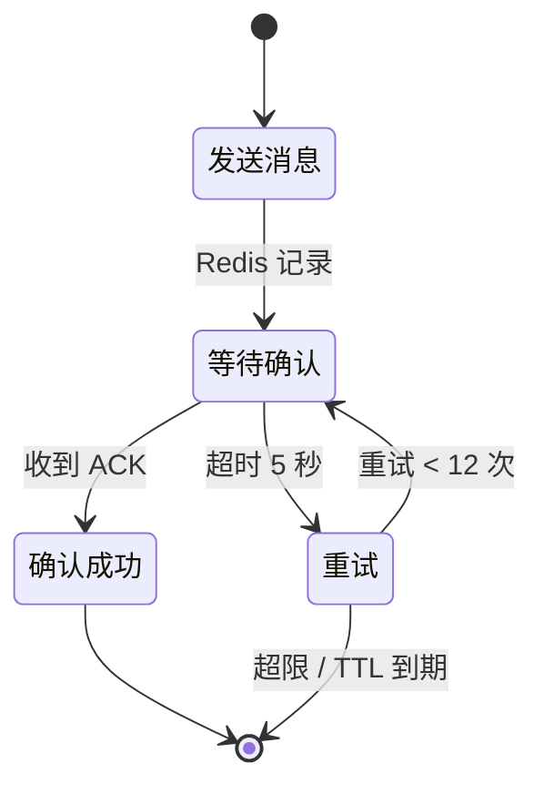

# Quick-Notify

```
██████╗ ███████╗██╗   ██╗    ███████╗ ██████╗██████╗  ██████╗ ███╗   ███╗
██╔══██╗██╔════╝██║   ██║    ██╔════╝██╔════╝██╔══██╗██╔═══██╗████╗ ████║
██████╔╝█████╗  ██║   ██║    █████╗  ██║     ██████╔╝██║   ██║██╔████╔██║
██╔══██╗██╔══╝  ╚██╗ ██╔╝    ██╔══╝  ██║     ██╔══██╗██║   ██║██║╚██╔╝██║
██║  ██║███████╗ ╚████╔╝     ███████╗╚██████╗██║  ██║╚██████╔╝██║ ╚═╝ ██║
╚═╝  ╚═╝╚══════╝  ╚═══╝      ╚══════╝ ╚═════╝╚═╝  ╚═╝ ╚═════╝ ╚═╝     ╚═╝
```

### Enterprise-Grade Real-Time Notification System

> 基于 **Spring Boot 3 + WebSocket STOMP + Redis** 的企业级实时消息推送系统，支持集群部署、认证鉴权、ACK 确认、消息持久化，已在**万级日活生产环境**验证。

[](https://spring.io/projects/spring-boot)
[](https://www.oracle.com/java/)
[](LICENSE)
[](https://github.com/yangli-stu/quick-notify)

---

## ✨ 特性亮点

| 特性 | 描述 |
|------|------|
| ⚡ **实时推送** | 基于 WebSocket + STOMP 协议，SockJS 兼容，浏览器/App 均可直连，P99 延迟 < 50ms |
| ✅ **ACK 确认** | 消息发送后进入等待确认状态，超时自动重试，最多次 12 次、TTL 60 秒，确保可靠送达 |
| 🔐 **安全认证** | 基于 Token 鉴权，连接时携带 Authorization 头，限制每用户最多 10 个并发连接 |
| 🌐 **集群支持** | 基于 Redis Pub/Sub 广播到所有节点，每个节点检查本地会话后投递，支持水平扩展 |
| 💾 **消息持久化** | 消息发送前先持久化到数据库，JPA + 雪花 ID 算法，支持 MySQL/H2 等多种数据库 |
| 🚀 **Starter 模式** | 引入依赖后自动配置，零 XML 配置，只需提供 Redis 连接地址即可运行 |

---

## 📊 性能基准

| 指标 | 数据 |
|------|------|
| 消息延迟 | < 50ms（P99） |
| 单机并发 | 10,000+ WebSocket 连接 |
| 消息吞吐 | 5,000+ msg/s |
| ACK 重试 | 最多 12 次，60 秒 TTL |

---

## 🏗️ 整体架构


```mermaid
graph TB
    subgraph Client [客户端]
        Browser[浏览器 / App]
    end
    subgraph Server [服务端]
        WS[WebSocket Endpoint]
        Handler[StompWebSocketHandler]
        Interceptor[鉴权拦截器]
    end
    subgraph Storage [存储层]
        Redis[(Redis<br/>ACK + Pub/Sub)]
        DB[(MySQL / H2<br/>消息持久化)]
    end

    Browser --> WS --> Interceptor --> Handler
    Handler <--> Redis
    Handler --> DB
```

**数据流**：客户端 → WebSocket → 鉴权 → Handler → Redis(广播) / DB(持久化)

---

## 📡 消息流程

### 1. 连接认证


```mermaid
sequenceDiagram
    participant C as 客户端
    participant I as 鉴权拦截器
    participant R as SimpUserRegistry

    C->>I: CONNECT (Token)
    I->>I: 解析 Token
    I->>R: 检查会话数 ≤ 10
    alt 会话数超限
        I-->>C: 连接拒绝
    else 会话数正常
        I->>R: 注册会话
        I-->>C: CONNECTED
    end
```

1. 客户端发起 WebSocket CONNECT 请求，携带 Token
2. `StompWebsocketInterceptor` 拦截并解析 Token
3. 检查该用户会话数是否 ≤ 10
4. 超限则拒绝，未超限则注册会话并返回 CONNECTED

### 2. 消息发送


```mermaid
sequenceDiagram
    participant A as 业务方
    participant M as NotifyManager
    participant DB as 数据库
    participant E as Spring Event
    participant L as EventListener
    participant R as Redis
    participant H as StompWebSocketHandler
    participant C as 客户端

    A->>M: saveAndPublish(msg)
    M->>DB: 持久化消息
    M->>E: 发布事件
    E->>L: 事件监听
    L->>R: Redis Pub/Sub 广播
    R-->>H: 跨节点投递
    H->>C: 发送消息
    C-->>H: ACK 确认
```

1. 业务方调用 `NotifyManager.saveAndPublish()` 发送消息
2. 消息先 **持久化到数据库**
3. 通过 **Spring Event** 异步触发监听
4. 监听器将消息 **发布到 Redis Topic**
5. 所有集群节点收到消息，检查目标用户是否有本地会话
6. 有会话则 **投递消息**，客户端收到后回复 **ACK**

### 3. 集群模式


```mermaid
sequenceDiagram
    participant A as 业务方
    participant N1 as 节点1
    participant N2 as 节点2
    participant R as Redis

    A->>N1: 消息(用户A)
    A->>N2: 消息(用户B)
    N1->>R: 发布 Topic
    N2->>R: 发布 Topic
    R-->>N1: 广播
    R-->>N2: 广播
```

不同节点收到业务消息后，统一发布到 **Redis Topic**，跨节点广播，确保每个节点都能检查并投递消息。

---

## ⚡ ACK 确认机制


```mermaid
stateDiagram-v2
    [*] --> 发送消息
    发送消息 --> 等待确认: Redis 记录
    等待确认 --> 确认成功: 收到 ACK
    确认成功 --> [*]
    等待确认 --> 重试: 超时 5 秒
    重试 --> 等待确认: 重试 < 12 次
    重试 --> [*]: 超限 / TTL 到期
```

- 消息发送后在 Redis Hash `stomp::pending_messages` 中创建记录
- 首次等待 **5 秒**，超时则重试
- 每次重试间隔 **5 秒**，最多 **12 次** 或 **60 秒** TTL
- 客户端收到消息后发送 ACK，服务端删除记录

---

## 🏗️ 核心实现类

| 组件 | 位置 | 职责 |
|------|------|------|
| `NotifyManager` | `notify/` | 消息入口，编排持久化和发布 |
| `NotifyEventListener` | `notify/event/` | 事件监听，Redis Pub/Sub 广播 |
| `StompWebSocketHandler` | `notify/stomp/` | 消息发送，ACK 追踪 |
| `StompWebsocketInterceptor` | `notify/stomp/` | Token 认证，连接数限制 |

---

## 🔧 快速开始

### 环境要求

- Java 21+
- Maven 3.8+
- Redis 6+

### 1. 启动 Redis

```bash
docker run -d --name redis -p 6379:6379 redis
```

### 2. 引入依赖

```xml
<dependency>
    <groupId>io.stu</groupId>
    <artifactId>quick-notify-spring-boot-starter</artifactId>
    <version>0.0.1-SNAPSHOT</version>
</dependency>
```

### 3. 配置（可选）

```yaml
spring:
  datasource:
    url: jdbc:h2:mem:quicknotify
  sql:
    init:
      mode: always
      schema-locations: classpath:schema.sql

redisson:
  single-server-config:
    address: redis://127.0.0.1:6379
```

### 4. 发送消息

```java
@Autowired
private NotifyManager notifyManager;

NotifyMessageLog message = NotifyMessageLog.builder()
    .receiver("user123")
    .type("ORDER_STATUS")
    .data(orderData)
    .build();

notifyManager.saveAndPublish(message);
```

### 5. 前端订阅

```javascript
const stompClient = Stomp.over(new SockJS('/stomp-ws'));

// 1. 先创建连接（带 Token）
stompClient.connect(
    { Authorization: 'Bearer your-token' },
    function(frame) {
        // 2. 连接成功后在回调中订阅
        stompClient.subscribe('/user/queue/msg', function(message) {
            const data = JSON.parse(message.body);
            console.log('收到消息:', data);

            // 3. 发送 ACK 确认
            stompClient.send('/app/ack', {}, data.id);
        });
    }
);
```

---

## 🔍 与其他方案对比

| 特性 | Quick-Notify | Socket.IO | SSE | MQTT |
|------|--------------|-----------|-----|------|
| 协议 | WebSocket + STOMP | WebSocket | HTTP | TCP/MQTT |
| 集群支持 | ✅ Redis Pub/Sub | ❌ 需适配 | ❌ 不支持 | ✅ Broker |
| 消息确认 | ✅ ACK 机制 | ⚠️ 需配置 | ❌ 不支持 | ✅ QoS |
| Spring 集成 | ✅ 原生 | ⚠️ 社区 | ⚠️ 社区 | ⚠️ 社区 |
| 学习成本 | 低 | 中 | 低 | 高 |

---

## 🧪 运行示例

```bash
# 运行示例应用
mvn spring-boot:run -pl quick-notify-example

# 打开测试页面
open http://localhost:2025/stomp-websocket-sockjs.html

# 发送测试消息
curl -X POST -d "Hello World" http://localhost:2025/vh-stomp-wsend/push_all_obj/test1
```

---

## 📁 项目结构

```
quick-notify/
├── quick-notify-spring-boot-starter/  # 核心 Starter 模块
│   └── src/main/java/io/stu/notify/
│       ├── QuickNotifyAutoConfiguration.java
│       ├── NotifyManager.java
│       ├── model/          # 消息模型
│       ├── repository/     # 数据持久化
│       ├── event/         # Spring Event + Redis Pub/Sub
│       └── stomp/         # WebSocket + STOMP
│
└── quick-notify-example/  # 示例应用
    └── src/main/resources/static/stomp-websocket-sockjs.html
```

---

## 📖 文档导航

| 文档 | 说明 |
|------|------|
| [快速入门](./website/blog-articles/01-quick-start-guide.md) | 5 分钟快速上手 |
| [接入指南](./website/blog-articles/02-spring-boot-starter-guide.md) | Spring Boot Starter 使用 |
| [协议原理](./website/blog-articles/03-websocket-stomp-principle.md) | WebSocket STOMP 深入理解 |
| [ACK 设计](./website/blog-articles/04-ack-reliability-design.md) | 消息确认机制详解 |
| [集群方案](./website/blog-articles/05-redis-cluster-solution.md) | Redis 集群实现 |
| [生产部署](./website/blog-articles/07-production-deployment.md) | 生产环境部署 |

完整文档请查看 [website/blog-articles](./website/blog-articles/) 目录。

---

## 📄 许可证

本项目基于 [MIT License](LICENSE) 开源。

---

<p align="center">
  <strong>如果对你有帮助，请 star ⭐ 支持一下！</strong>
</p>
