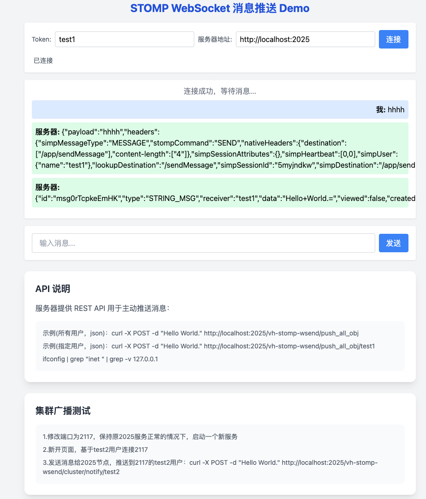

下面是你提供的 `README.md` 的**优化版本**，重点提升了结构清晰度、语言表达专业性以及整体的可读性和排版美观性，更适合开源项目或团队内部文档：

---

# Spring Boot 3 + WebSocket STOMP + 集群会话 + Token 认证集成示例

## 🔧 Demo 演示

* 打开浏览器访问：`src/main/resources/stomp-websocket-sockjs.html`
* 示例截图：

  

---

## 📖 项目简介

本项目展示了如何在 Spring Boot 应用中集成 WebSocket + STOMP，实现：

* 实时消息通信
* Token 用户认证
* 点对点消息推送
* 集群环境下的 WebSocket 会话转发

适用于社交类消息通知、实时状态更新、在线客服等场景。

---

## 🧱 核心模块结构

路径：`src/main/java/io/stu/notify/stomp`

```
├── NotifyMessage.java               // WebSocket 消息结构定义
├── NotifyType.java                  // 消息类型枚举
├── StompWebSocketHandler.java       // 消息推送管理器
├── StompWebsocketConfig.java        // STOMP/WebSocket 配置
└── StompWebsocketInterceptor.java   // 鉴权拦截器
```

### 🔌 `StompWebsocketConfig`

* **作用**：配置 WebSocket 端点与消息代理。
* **说明**：实现 `WebSocketMessageBrokerConfigurer` 接口。

### 🛡️ `StompWebsocketInterceptor`

* **作用**：拦截 WebSocket 连接请求，基于 Token 鉴权。
* **说明**：实现 `ChannelInterceptor`，绑定用户与会话。

### 📬 `StompWebSocketHandler`

* **作用**：管理用户会话及消息发送（广播/点对点）。
* **说明**：封装 `SimpMessagingTemplate`，提供统一的推送入口。

### 💬 `NotifyMessage`

* **作用**：自定义的消息格式对象。
* **字段**：消息 ID、接收者、消息体、类型、状态等。

### 🧾 `NotifyType`

* **作用**：定义支持的通知类型。
* **说明**：使用枚举 + 类型校验机制，避免数据结构不一致。

---

## 🚀 使用示例

### 广播消息

```java
webSocketHandler.broadcastMessage(new NotifyMessage("messageId", "messageData"));
```

### 向指定用户发送消息

```java
webSocketHandler.sendMessage(new NotifyMessage("messageId", "receiverUserId", "messageData"));
```

---

# ☁️ 集群模式：跨节点会话转发

## ✨ 核心类：`StompNotifyEventListener`

用于支持 **分布式 WebSocket 会话处理**，结合 Redisson + Redis Topic 实现。

### 📌 处理流程

1. **检查本地会话**

    * 如果当前节点存在目标用户会话：**直接推送**
    * 否则：**广播事件到其他节点**

2. **集群事件广播**

    * 使用 `Redisson` 发布事件到 Redis Topic
    * 所有节点订阅该 Topic 实现集群通信

3. **跨节点接收处理**

    * 接收到广播事件后判断是否拥有目标会话
    * 若存在：推送给用户，否则忽略

---

## 📈 架构图（简化版）

```
  NotifyMessageEvent
         │
         ▼
 StompNotifyEventListener
         │
    ┌────┴────────────┐
    │                 │
[当前节点有会话]   [无会话：广播事件]
    │                 │
    ▼                 ▼
WebSocket推送     Redis发布事件
                      │
                      ▼
           其他节点监听事件并推送
```

---

## 💾 消息持久化与业务集成

### 核心类：`NotifyManager`

负责将消息保存至数据库，并异步推送至集群节点。

```java
@Transactional(rollbackFor = Throwable.class)
public NotifyMessageLog saveAndPublish(NotifyMessageLog msg) {
    NotifyType.valueOf(msg.getType()).checkDataType(msg.getData());

    // 1. 消息持久化
    notifyMessageLogRepository.save(msg);

    // 2. 异步推送事件
    SpringContextUtil.publishEvent(new NotifyMessageEvent(msg));
    return msg;
}
```

---

## ✅ 总结

本项目提供了一个完整的 WebSocket 实时通信集成方案，覆盖：

* STOMP 协议支持
* Token 认证与用户绑定
* 分布式消息转发（基于 Redis）
* 消息持久化与业务解耦

可作为企业级项目中的即时通讯/通知模块的参考模板。
