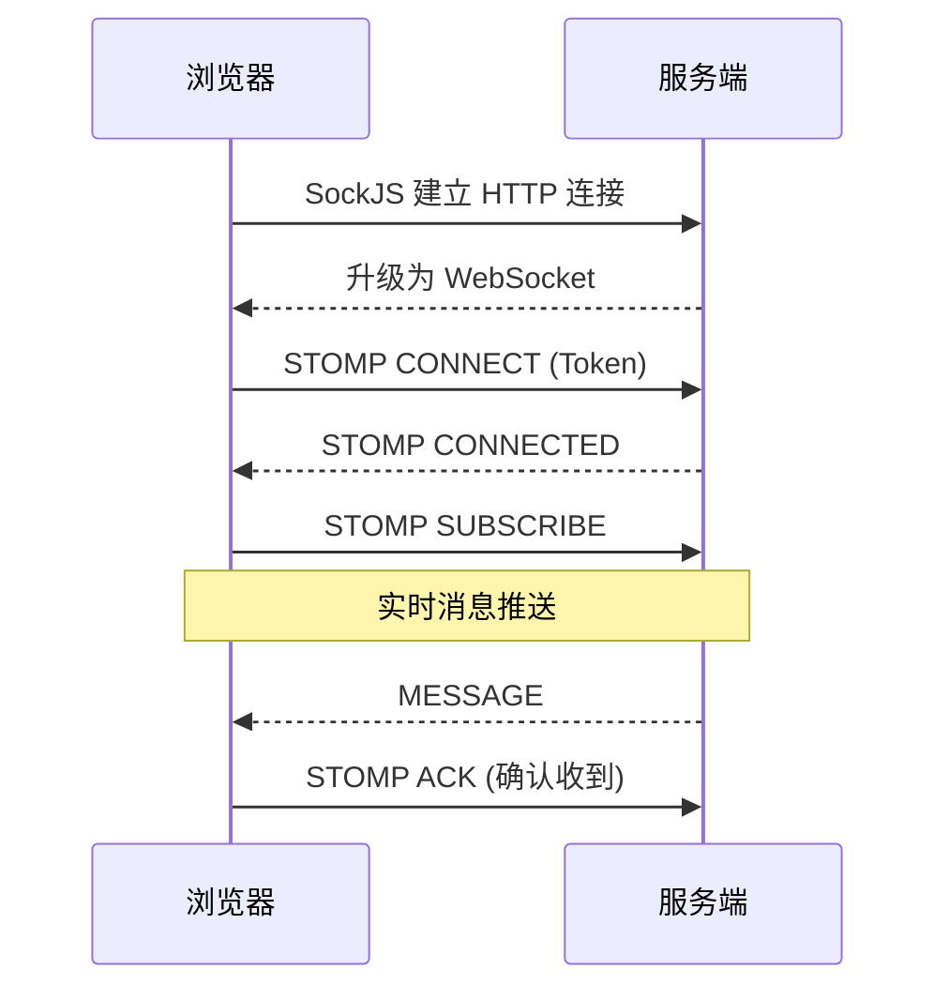

**日期**: 2026-04-11
**标签**: 入门


## 前言

在现代 Web 应用中，实时消息推送是一个常见需求：

- 社交 App 的新消息提醒
- 电商平台的订单状态更新
- 在线客服的实时沟通
- 监控系统的实时告警

本文将介绍如何使用 **Quick-Notify** 在 5 分钟内快速搭建一个企业级的实时消息推送系统。


## 一、技术选型

### 为什么选择 Quick-Notify？

| 特性 | Quick-Notify | 自研 | Socket.IO |
|------|--------------|------|-----------|
| 开发周期 | 5 分钟 | 1-2 周 | 2-3 天 |
| 集群支持 | 开箱即用 | 需从头开发 | 需适配 |
| ACK 确认 | 内置 | 需开发 | 需配置 |
| 消息持久化 | 支持 | 需开发 | 不支持 |


## 二、前置知识

### 2.1 基本概念

在开始之前，你需要了解以下基本概念：

| 概念 | 说明 |
|------|------|
| **WebSocket** | 全双工通信协议，服务器可主动推送 |
| **STOMP** | 消息协议，定义消息格式和路由规则 |
| **SockJS** | WebSocket 降级方案，保证浏览器兼容性 |
| **ACK** | 消息确认机制，确保消息可靠送达 |

### 2.2 整体架构



### 2.3 环境要求

- JDK 21+
- Maven 3.8+
- Redis 6+（或 Docker）


## 三、项目搭建

### 3.1 启动 Redis

```bash
# 使用 Docker 启动 Redis
docker run -d --name redis -p 6379:6379 redis

# 验证 Redis 是否启动成功
docker ps | grep redis
```

### 3.2 添加 Quick-Notify 依赖

在 Spring Boot 项目的 `pom.xml` 中添加：

```xml
<dependency>
    <groupId>io.stu</groupId>
    <artifactId>quick-notify-spring-boot-starter</artifactId>
    <version>0.0.1-SNAPSHOT</version>
</dependency>
```

### 3.3 配置 application.yml

```yaml
spring:
  application:
    name: my-app
  datasource:
    driver-class-name: org.h2.Driver
    url: jdbc:h2:mem:quicknotify;MODE=MySQL;DB_CLOSE_DELAY=-1
    username: sa
    password:
  sql:
    init:
      mode: always

redisson:
  single-server-config:
    address: redis://127.0.0.1:6379

server:
  port: 8080
```

### 3.4 启动类

```java
@SpringBootApplication
public class MyAppApplication {
    public static void main(String[] args) {
        SpringApplication.run(MyAppApplication.class, args);
    }
}
```

**注意**：Quick-Notify 使用 Starter 模式，**无需添加 `@ComponentScan`**，自动配置会自动生效。


## 四、后端发送消息

### 4.1 注入 NotifyManager

```java
@Service
public class OrderService {

    @Autowired
    private NotifyManager notifyManager;

    public void sendOrderNotification(String userId, String orderId, String status) {
        // 构建消息
        Map<String, Object> data = new HashMap<>();
        data.put("orderId", orderId);
        data.put("status", status);
        data.put("message", "您的订单已" + status);

        // 发送通知
        NotifyMessageLog message = NotifyMessageLog.builder()
            .receiver(userId)
            .type("ORDER_STATUS")
            .data(data)
            .viewed(false)
            .build();

        notifyManager.saveAndPublish(message);
    }
}
```

### 4.2 REST API 发送（测试用）

```java
@RestController
public class TestController {

    @Autowired
    private NotifyManager notifyManager;

    @PostMapping("/notify/{userId}")
    public String notifyUser(@PathVariable String userId, @RequestBody String message) {
        NotifyMessageLog msg = NotifyMessageLog.builder()
            .receiver(userId)
            .type("STRING_MSG")
            .data(message)
            .build();

        notifyManager.saveAndPublish(msg);
        return "消息已发送";
    }
}
```


## 五、前端集成

### 5.1 引入依赖

在 HTML 中引入 SockJS 和 STOMP 客户端库：

```html
<script src="https://cdn.jsdelivr.net/npm/sockjs-client@1.6.1/dist/sockjs.min.js"></script>
<script src="https://cdn.jsdelivr.net/npm/@stomp/stompjs@7.0.0/lib/stomp.umd.min.js"></script>
```

### 5.2 WebSocket 连接与订阅

**连接流程说明**：

1. **创建客户端**：使用 SockJS 封装 WebSocket 连接
2. **携带 Token 连接**：在 `connect()` 中传入 `Authorization` header 进行认证
3. **订阅消息**：在连接成功的回调函数中订阅 `/user/queue/msg`
4. **ACK 确认**：收到消息后发送 ACK 确认

**关键代码**：

```javascript
// Step 1: 创建 STOMP 客户端
const stompClient = Stomp.over(new SockJS('http://localhost:8080/stomp-ws'));

// Step 2: 连接 WebSocket
// dev 模式：token 直接作为用户ID（如 'testuser'）
// 生产环境：请替换为真实的 JWT Token
stompClient.connect(
    { Authorization: 'testuser' },

    // Step 3: 连接成功回调 - 必须在此订阅消息
    function(frame) {
        console.log('连接成功');

        // 订阅个人消息队列
        stompClient.subscribe('/user/queue/msg', function(message) {
            const data = JSON.parse(message.body);
            console.log('收到消息:', data);

            // Step 4: 发送 ACK 确认
            stompClient.send('/app/ack', {}, data.id);
        });
    },

    // 连接失败回调
    function(error) {
        console.error('连接失败:', error);
    }
);
```

**注意事项**：

- Token 认证：CONNECT 帧通过 `Authorization` header 携带用户标识
- 订阅时机：必须在 `connect()` 成功回调中订阅，不能在外部订阅
- 消息路由：订阅 `/user/queue/msg` 会自动路由到 `/user/{userId}/queue/msg`
- dev 模式：token 直接作为用户ID；生产环境需继承 `StompWebsocketInterceptor` 重写 `extractUserId()` 实现 JWT 解析

### 5.3 完整示例页面

```html
<!DOCTYPE html>
<html>
<head>
    <title>Quick-Notify Demo</title>
    <script src="https://cdn.jsdelivr.net/npm/sockjs-client@1.6.1/dist/sockjs.min.js"></script>
    <script src="https://cdn.jsdelivr.net/npm/@stomp/stompjs@7.0.0/lib/stomp.umd.min.js"></script>
</head>
<body>
    <h1>Quick-Notify 演示</h1>
    <div id="messages"></div>
    <button onclick="sendMessage()">发送测试消息</button>

    <script>
        const stompClient = Stomp.over(new SockJS('http://localhost:8080/stomp-ws'));

        stompClient.connect(
            { Authorization: 'testuser' },
            function() {
                console.log('连接成功，开始订阅消息');

                stompClient.subscribe('/user/queue/msg', function(message) {
                    const data = JSON.parse(message.body);
                    document.getElementById('messages').innerHTML +=
                        '<p>收到消息: ' + data.data + '</p>';

                    // 发送 ACK 确认
                    stompClient.send('/app/ack', {}, data.id);
                });
            }
        );

        function sendMessage() {
            fetch('/notify/testuser', {
                method: 'POST',
                body: 'Hello World!'
            });
        }
    </script>
</body>
</html>
```


## 六、测试验证

### 6.1 启动应用

```bash
mvn spring-boot:run
```

### 6.2 发送测试消息

```bash
# 发送消息给 testuser
curl -X POST -d "Hello from curl!" http://localhost:8080/notify/testuser
```

### 6.3 预期效果

1. WebSocket 连接成功（浏览器控制台显示 "连接成功"）
2. 收到消息推送（页面显示消息内容）
3. ACK 确认日志（服务端显示 "确认成功"）


## 七、常见问题

### Q1: 启动报错 "Port 8080 was already in use"

```bash
# 查找占用端口的进程
lsof -i :8080

# 终止进程
kill -9 <PID>
```

### Q2: 消息发送成功但客户端收不到

1. 检查客户端是否正确连接到 `/stomp-ws` 端点
2. 确认 Token 认证通过
3. 查看服务端日志是否有 `[ACK-REDIS]` 相关输出

### Q3: Redis 连接失败

```bash
# 确认 Redis 已启动
docker ps | grep redis

# 如果没有运行，启动 Redis
docker run -d --name redis -p 6379:6379 redis
```


## 八、总结

本文介绍了如何使用 Quick-Notify Spring Boot Starter 快速搭建实时消息推送系统：

- **5 分钟即可接入**
- **一行依赖，零配置**
- **支持集群部署**
- **ACK 消息确认**
- **消息持久化**

完整源码请参考 [quick-notify-example](https://github.com/yangli-stu/quick-notify/tree/main/quick-notify-example) 模块。


## 下一步

- [Spring Boot Starter 插件化开发实践](./02-spring-boot-starter-guide.md)
- [WebSocket STOMP 协议深入理解](./03-websocket-stomp-principle.md)
- [ACK 确认机制详解](./04-ack-reliability-design.md)
