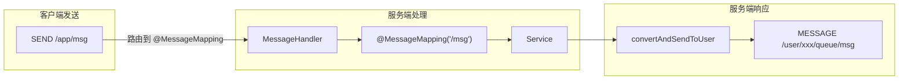

## 前言

WebSocket 和 STOMP 是现代实时 Web 应用的两大基石。本文将从协议原理讲起，深入分析 STOMP 的工作机制，解答为什么 Quick-Notify 选择 STOMP 而不是原生 WebSocket 或其他方案。

## 一、WebSocket 协议基础

### 1.1 HTTP 轮询 vs WebSocket

**HTTP 轮询**（Polling）：

```
客户端                              服务端
   |                                  |
   |------- GET /messages ----------->|
   |<------ 200 OK [messages] --------|
   |                                  |
   |------- GET /messages ----------->|  (重复请求)
   |<------ 200 OK [messages] --------|
```

**问题**：浪费带宽，延迟高（最多等到下一次轮询）

**WebSocket**：

```
客户端                              服务端
   |                                  |
   |------- HTTP Upgrade ------------>|
   |       Upgrade: websocket          |
   |<------ 101 Switching Protocols ---|
   |                                  |
   |========= TCP 连接建立 ===========|
   |                                  |
   |<====== 服务器主动推送 ============|
   |<====== 服务器主动推送 ============|
```

**优势**：全双工通信，服务器可以主动推送，延迟极低。

### 1.2 WebSocket 帧结构

```
 0                   1                   2                   3
 0 1 2 3 4 5 6 7 8 9 0 1 2 3 4 5 6 7 8 9 0 1 2 3 4 5 6 7 8 9 0 1
+-+-+-+-+-------+-+-------------+-------------------------------+
|F|R|R|R| opcode|M| Payload len |    Extended payload length    |
|I|S|S|S|  (4)  |A|     (7)     |             (16/64)           |
|N|V|V|V|       |S|             |   (if payload len==126/127)   |
| |1|2|3|       |K|             |                               |
+-+-+-+-+-------+-+-------------+ - - - - - - - - - - - - - - - +
|                               |         Masking-key            |
|     Extended payload length   |         (if MASK set)         |
+ - - - - - - - - - - - - - - - + - - - - - - - - - - - - - - - +
|                               |                               |
|         Payload Data          |         Payload Data          |
|                               |                               |
+-------------------------------------------------------------- -+
```

**opcode**：
- `0x0`：延续帧
- `0x1`：文本帧
- `0x2`：二进制帧
- `0x8`：关闭帧
- `0x9`：Ping 帧
- `0xA`：Pong 帧

### 1.3 WebSocket 的局限性

虽然 WebSocket 很强大，但它**只是一个传输协议**，不定义消息的格式和路由规则：

```
原生 WebSocket 问题：
1. 消息格式不统一
2. 路由规则自定义
3. 缺少消息确认机制
4. 不支持订阅/发布模式
```

## 二、STOMP 协议详解

### 2.1 什么是 STOMP？

STOMP（Simple Text Oriented Messaging Protocol）是一个简单的**文本消息协议**，类似于 HTTP，采用帧（Frame）的形式传输数据。

**设计目标**：
- 简单易实现
- 跨语言（任何语言都可以解析文本帧）
- 支持订阅/发布模式
- 提供消息确认机制

### 2.2 STOMP 帧结构

```
COMMAND
header1:value1
header2:value2

Body^@
```

**示例 - 发送消息**：

```
SEND
destination:/app/queue msg
content-type:application/json

{"message":"Hello"}^@
```

**示例 - 订阅**：

```
SUBSCRIBE
id:sub-1
destination:/user/queue/msg

^@
```

### 2.3 STOMP 命令

| 客户端命令 | 服务端命令 | 说明 |
|-----------|-----------|------|
| CONNECT | CONNECTED | 建立连接 |
| SUBSCRIBE | MESSAGE | 订阅/接收消息 |
| SEND | - | 发送消息 |
| DISCONNECT | - | 断开连接 |
| ACK | - | 确认收到消息 |
| NACK | - | 消息处理失败 |
| BEGIN | - | 开始事务 |
| COMMIT | - | 提交事务 |
| ABORT | - | 回滚事务 |

### 2.4 STOMP vs 原生 WebSocket

| 特性 | STOMP | 原生 WebSocket |
|------|-------|---------------|
| 消息格式 | 标准 JSON | 自定义 |
| 订阅机制 | 内置 SUBSCRIBE | 需自己实现 |
| 路由规则 | 基于 destination | 自定义 |
| 消息确认 | ACK/NACK 内置 | 需自己实现 |
| 事务支持 | BEGIN/COMMIT/ABORT | 不支持 |
| 调试工具 | 有（stomp-cli）| 无 |

## 三、Spring WebSocket 架构

### 3.1 核心组件

```
┌─────────────────────────────────────────────────────────────┐
│                     Spring WebSocket 架构                    │
├─────────────────────────────────────────────────────────────┤
│                                                             │
│  ┌───────────┐     ┌─────────────┐     ┌───────────────┐   │
│  │ SockJS    │────▶│ WebSocket   │────▶│ STOMP         │   │
│  │ Client    │     │ Handler     │     │ Decoder       │   │
│  └───────────┘     └─────────────┘     └───────────────┘   │
│                           │                    │           │
│                           ▼                    ▼           │
│                   ┌─────────────┐     ┌───────────────┐   │
│                   │ Channel     │     │ Message       │   │
│                   │ Interceptor │     │ Handler       │   │
│                   └─────────────┘     └───────────────┘   │
│                                              │             │
│                                              ▼             │
│                                    ┌─────────────────┐    │
│                                    │ @MessageMapping │    │
│                                    │ Controller      │    │
│                                    └─────────────────┘    │
│                                                             │
└─────────────────────────────────────────────────────────────┘
```

### 3.2 Spring 配置解析

**`StompWebsocketConfig.java`**：

```java
@Configuration
@EnableWebSocketMessageBroker
public class StompWebsocketConfig implements WebSocketMessageBrokerConfigurer {

    // 配置消息代理（订阅路径前缀）
    @Override
    public void configureMessageBroker(MessageBrokerRegistry registry) {
        // 方式1：内存代理（简单场景）
        registry.enableSimpleBroker("/topic", "/queue");

        // 方式2：外部代理（生产环境，如 RabbitMQ/ActiveMQ）
        // registry.enableStompBrokerRelay("/topic", "/queue")
        //     .setRelayHost("localhost")
        //     .setRelayPort(61613);

        // 客户端发送消息的前缀
        registry.setApplicationDestinationPrefixes("/app");

        // 用户专属消息的前缀（自动路由到 /user/{userId}/...）
        registry.setUserDestinationPrefix("/user");
    }

    // 注册 STOMP 端点
    @Override
    public void registerStompEndpoints(StompEndpointRegistry registry) {
        registry.addEndpoint("/stomp-ws")           // 端点路径
            .setAllowedOriginPatterns("*")           // 允许跨域
            .withSockJS();                          // 启用 SockJS
    }
}
```

### 3.3 消息路由详解



**路径说明**：

| 路径 | 说明 | 路由 |
|------|------|------|
| `/app/*` | 应用前缀 | 路由到 `@MessageMapping` |
| `/topic/*` | 广播前缀 | 广播给所有订阅者 |
| `/queue/*` | 队列前缀 | 点对点消息 |
| `/user/*` | 用户前缀 | 自动转换为 `/user/{userId}/*` |

## 四、SockJS 的作用

### 4.1 为什么需要 SockJS？

WebSocket 在某些环境下不可用：

1. **企业防火墙**：可能阻止 WebSocket 升级
2. **代理服务器**：某些老旧代理不支持
3. **浏览器兼容**：老版本浏览器不支持

### 4.2 SockJS 回退机制

SockJS 会自动降级到以下方案：

```
1. WebSocket ✓（最佳）
2. Streaming (iframe + XHR streaming)
3. Long Polling (XHR polling)
4. JSONP Polling（最后方案）
```

### 4.3 SockJS 配置

```java
registry.addEndpoint("/stomp-ws")
    .setAllowedOriginPatterns("*")
    .withSockJS()
    .setHeartbeatTime(10000)      // 心跳间隔 10 秒
    .setDisconnectDelay(30000);    // 30 秒无响应断开
```

## 五、心跳机制

### 5.1 为什么需要心跳？

1. **检测连接存活**：网络断开时及时发现
2. **保持连接活跃**：防止空闲连接被中间设备关闭
3. **负载均衡器感知**：某些 LB 需要心跳维持会话粘性

### 5.2 心跳配置

```java
// 服务端心跳
registry.enableSimpleBroker("/topic", "/queue")
    .setHeartbeatValue(new long[]{10000, 10000})  // [client→server, server→client]
    .setTaskScheduler(heartbeatScheduler);         // 需要 TaskScheduler

// 客户端心跳（JavaScript）
const stompClient = Stomp.over(socket, {
    heartbeatIncoming: 10000,  // 期望收到服务端心跳
    heartbeatOutgoing: 10000   // 客户端发送心跳
});
```

### 5.3 断连检测

```java
// SockJS 断连延迟配置
.withSockJS()
.setDisconnectDelay(30000);  // 30 秒无心跳认为断连
```

## 六、生产环境踩坑记录

### 6.1 坑1：消息丢失

**现象**：客户端偶发消息丢失

**原因**：
1. 网络抖动导致消息未送达
2. 客户端处理失败但没重试
3. 服务重启导致内存消息丢失

**解决**：实现 ACK 确认机制（Quick-Notify 内置）

### 6.2 坑2：消息乱序

**现象**：多设备收到消息顺序不一致

**原因**：不同设备的网络延迟不同

**解决**：
1. 消息携带时间戳，客户端按时间戳排序
2. 使用序列号（sequence）确保顺序

### 6.3 坑3：内存泄漏

**现象**：长时间运行后内存持续增长

**原因**：
1. 订阅未取消
2. Session 未清理
3. 消息堆积

**解决**：

```java
// 取消订阅
stompClient.unsubscribe('/user/queue/msg');

// 监听断连
stompClient.onDisconnect = function() {
    console.log('连接断开');
};
```

## 七、最佳实践

### 7.1 消息格式设计

```json
{
    "id": "msg_123456",
    "type": "ORDER_STATUS",
    "timestamp": 1704067200000,
    "sequence": 100,
    "data": {
        "orderId": "ORD_001",
        "status": "PAID"
    }
}
```

### 7.2 订阅管理

```javascript
class SubscriptionManager {
    constructor() {
        this.subscriptions = new Map();
    }

    subscribe(destination, callback) {
        const id = stompClient.subscribe(destination, (msg) => {
            const data = JSON.parse(msg.body);
            callback(data);
        });
        this.subscriptions.set(destination, id);
    }

    unsubscribe(destination) {
        const id = this.subscriptions.get(destination);
        if (id) {
            id.unsubscribe();
            this.subscriptions.delete(destination);
        }
    }

    unsubscribeAll() {
        this.subscriptions.forEach(id => id.unsubscribe());
        this.subscriptions.clear();
    }
}
```

### 7.3 断线重连

```javascript
function connect() {
    const stompClient = Stomp.over(new SockJS('/stomp-ws'));

    stompClient.connect({}, function() {
        console.log('连接成功');
        subscribe();
    }, function(error) {
        console.error('连接失败，5秒后重试', error);
        setTimeout(connect, 5000);
    });
}
```

## 八、总结

本文深入分析了 WebSocket 和 STOMP 协议：

- **WebSocket**：全双工通信协议，传输层基础
- **STOMP**：在 WebSocket 之上定义的消息协议，提供订阅/发布、确认等机制
- **SockJS**：WebSocket 的降级方案，保证兼容性
- **Spring WebSocket**：对 STOMP 的完整实现

**Quick-Notify 选择 STOMP 的原因**：
1. ✅ 标准协议，工具丰富
2. ✅ 订阅机制完善
3. ✅ 支持消息确认
4. ✅ Spring 深度集成
5. ✅ 易于调试

---

## 下一步

- ✅ [ACK 确认机制详解](./04-ack-reliability-design.md)
- 🌐 [Redis 集群方案](./05-redis-cluster-solution.md)
- 📱 [多设备同步与幂等性](./06-multi-device-sync.md)
