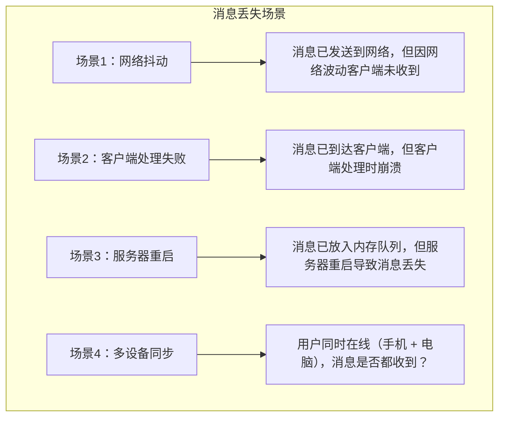
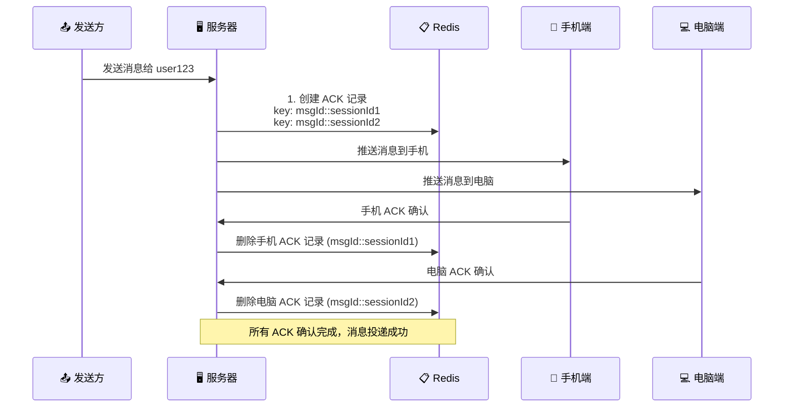

## 前言

在企业级消息推送系统中，**消息可靠送达**是最基本也是最重要的需求。网络抖动、客户端崩溃、服务器故障等都可能导致消息丢失。本文将深入讲解 Quick-Notify 如何设计 ACK 确认机制，确保每一条消息都能可靠送达。

## 一、为什么需要 ACK 确认

### 1.1 消息丢失场景



### 1.2 ACK 机制要解决的问题

1. **确认送达**：客户端收到消息后发送 ACK
2. **自动重试**：未确认的消息自动重发
3. **过期清理**：避免无限重试和内存泄漏
4. **会话追踪**：同一用户多设备独立确认

## 二、ACK 机制设计

### 2.1 整体流程



### 2.2 核心数据结构

**Redis Hash 结构**：

```
Key: stomp::pending_messages
├── Field: msgId::sessionId1  →  NotifyMessage (手机)
├── Field: msgId::sessionId2  →  NotifyMessage (电脑)
└── Field: msgId::sessionId3  →  NotifyMessage (平板)
```

**消息对象**：

```java
public class NotifyMessage implements Serializable {
    private String id;              // 消息 ID
    private String type;            // 消息类型
    private String receiver;        // 接收者
    private Object data;            // 消息内容
    private boolean viewed;         // 是否已读

    // ACK 相关字段
    private int ackRetryCount;      // 重试次数
    private long ackLastSent;       // 最后发送时间
    private long created;           // 创建时间
}
```

## 三、核心实现

### 3.1 发送消息并创建 ACK 记录

```java
public class StompWebSocketHandler {

    private static final String PENDING_MAP_KEY = "stomp::pending_messages";

    /**
     * 发送消息并追踪 ACK
     */
    public void sendMessageWithAck(NotifyMessage message) {
        SimpUser user = userRegistry.getUser(message.getReceiver());

        if (user != null && user.hasSessions()) {
            // 遍历用户的所有会话（多设备）
            for (SimpSession session : user.getSessions()) {
                // 1. 先写入 Redis（确保 ACK 时能找到）
                addAckMessageRecord(message, session.getId());

                // 2. 再发送消息
                sendMessage(message, session.getId());
            }
        } else {
            log.warn("[ACK] 用户不在线, msgId: {}, receiver: {}",
                    message.getId(), message.getReceiver());
        }
    }

    /**
     * 添加 ACK 消息记录
     */
    public void addAckMessageRecord(NotifyMessage message, String sessionId) {
        String ackKey = buildAckKey(message.getId(), sessionId);

        // 设置 ACK 追踪字段
        if (message.getCreated() == 0L) {
            message.setCreated(System.currentTimeMillis());
        }
        message.setAckRetryCount(0);
        message.setAckLastSent(System.currentTimeMillis());

        // 写入 Redis Hash
        RMap<String, NotifyMessage> map = redisson.getMap(PENDING_MAP_KEY);
        map.put(ackKey, message);

        log.info("[ACK-REDIS] 消息入队, msgId {}, sessionId {}, receiver {}",
                message.getId(), sessionId, message.getReceiver());
    }

    /**
     * 构建 ACK Key
     */
    protected String buildAckKey(String messageId, String sessionId) {
        return messageId + "::" + sessionId;
    }
}
```

### 3.2 处理 ACK 确认

```java
/**
 * 处理 ACK 确认
 */
public boolean acknowledge(String receiver, String messageId, String sessionId) {
    if (sessionId == null || sessionId.isBlank()) {
        log.warn("[ACK] ACK确认失败, sessionId为空");
        return false;
    }

    String ackKey = buildAckKey(messageId, sessionId);
    RMap<String, NotifyMessage> map = redisson.getMap(PENDING_MAP_KEY);

    // 获取消息
    NotifyMessage msg = map.get(ackKey);
    if (msg == null) {
        log.warn("[ACK] ACK确认失败, 消息不存在, msgId: {}, sessionId: {}",
                messageId, sessionId);
        return false;
    }

    // 验证接收者
    if (!receiver.equals(msg.getReceiver())) {
        log.warn("[ACK] ACK确认失败, 接收者不匹配");
        return false;
    }

    // 删除 ACK 记录
    map.remove(ackKey);

    log.info("[ACK-REDIS] 确认成功, msgId {}, sessionId {}, retryCount {}",
            messageId, sessionId, msg.getAckRetryCount());

    return true;
}
```

### 3.3 定时重试任务

```java
@Scheduled(fixedDelay = 5000)  // 每 5 秒执行
public void retryRedisMessages() {
    RMap<String, NotifyMessage> map = redisson.getMap(PENDING_MAP_KEY);
    if (map.isEmpty()) return;

    log.info("[ACK-REDIS] 定时处理开始, total {}", map.size());

    int retry = 0, expired = 0;

    for (Map.Entry<String, NotifyMessage> entry : map.entrySet()) {
        String ackKey = entry.getKey();
        NotifyMessage msg = entry.getValue();

        // 1. 检查是否在等待窗口内（5 秒内创建的消息不重试）
        if (System.currentTimeMillis() - msg.getCreated() < 5000) {
            continue;
        }

        // 2. 检查是否超过重试次数或 TTL
        if (msg.getAckRetryCount() >= 12 ||
            System.currentTimeMillis() - msg.getCreated() > 60000) {
            map.remove(ackKey);
            expired++;
            log.warn("[ACK-REDIS] 消息过期, msgId {}", msg.getId());
            continue;
        }

        // 3. 检查用户是否还在线
        if (hasSession(msg.getReceiver())) {
            String[] parsed = ackKey.split("::");
            String sid = parsed[1];

            // 检查指定 session 是否还在线
            SimpUser user = userRegistry.getUser(msg.getReceiver());
            boolean sessionExists = user.getSessions().stream()
                    .anyMatch(s -> s.getId().equals(sid));

            if (sessionExists) {
                // 重发消息
                sendMessage(msg, sid);
                msg.setAckRetryCount(msg.getAckRetryCount() + 1);
                msg.setAckLastSent(System.currentTimeMillis());
                map.put(ackKey, msg);  // 更新记录

                retry++;
                log.debug("[ACK-REDIS] 重发, msgId {}, retryCount {}",
                        msg.getId(), msg.getAckRetryCount());
            }
        }
    }

    log.info("[ACK-REDIS] 定时处理完成, retried {}, expired {}", retry, expired);
}
```

## 四、配置参数

### 4.1 参数说明

| 参数 | 默认值 | 说明 |
|------|--------|------|
| `ACK_CHECK_WAIT_MS` | 5000ms | 首次检查等待时间（等待客户端处理） |
| `ACK_RETRY_INTERVAL_MS` | 5000ms | 重试间隔 |
| `ACK_MESSAGE_TTL_MS` | 60000ms | 消息最大存活时间（1 分钟） |
| `ACK_MAX_RETRY_COUNT` | 12 | 最大重试次数（TTL / 间隔） |

### 4.2 参数调优

```java
// 高可靠场景（金融、医疗）
.setAckCheckWaitMs(10000)     // 10 秒等待
.setAckRetryIntervalMs(5000)   // 5 秒重试
.setAckMessageTtlMs(120000)    // 2 分钟 TTL

// 高性能场景（社交、直播）
.setAckCheckWaitMs(2000)      // 2 秒等待
.setAckRetryIntervalMs(2000)   // 2 秒重试
.setAckMessageTtlMs(30000)     // 30 秒 TTL
```

## 五、多设备同步

### 5.1 多设备场景分析

```
用户 user123 同时在线：
├── 📱 iPhone (sessionId: sess_001)
├── 💻 Windows PC (sessionId: sess_002)
└── 📺 iPad (sessionId: sess_003)

消息 msg_abc 需要：
1. ✅ 发送到 sess_001，收到 ACK
2. ✅ 发送到 sess_002，收到 ACK
3. ✅ 发送到 sess_003，收到 ACK

所有 ACK 都确认后，才能认为消息投递成功
```

### 5.2 实现逻辑

```java
public void sendMessageWithAck(NotifyMessage message) {
    SimpUser user = userRegistry.getUser(message.getReceiver());

    if (user != null && user.hasSessions()) {
        // 为每个会话创建独立的 ACK 记录
        for (SimpSession session : user.getSessions()) {
            String ackKey = buildAckKey(message.getId(), session.getId());

            // 每个设备的 ACK 记录独立追踪
            addAckMessageRecord(message, session.getId());
            sendMessage(message, session.getId());

            log.info("[ACK] 消息发送到多设备, msgId: {}, sessionId: {}, 设备数: {}",
                    message.getId(), session.getId(), user.getSessions().size());
        }
    }
}
```

## 六、幂等性处理

### 6.1 为什么需要幂等

由于 ACK 重试机制，同一条消息可能被客户端收到多次。客户端需要实现幂等处理：

```javascript
// 客户端幂等处理（此代码在 connect 回调中执行）
const processedIds = new Set();

stompClient.subscribe('/user/queue/msg', function(message) {
    const data = JSON.parse(message.body);

    // 检查是否已处理
    if (processedIds.has(data.id)) {
        console.log('重复消息，跳过:', data.id);
        stompClient.send('/app/ack', {}, data.id);  // 仍需 ACK
        return;
    }

    // 标记为已处理
    processedIds.add(data.id);

    // 执行业务逻辑
    handleMessage(data);

    // 发送 ACK
    stompClient.send('/app/ack', {}, data.id);
});

// 定期清理，防止内存泄漏
setInterval(() => {
    const now = Date.now();
    processedIds.forEach(id => {
        // 清理 1 小时前的记录
        if (now - processedTimestamps.get(id) > 3600000) {
            processedIds.delete(id);
        }
    });
}, 60000);
```

## 七、监控与告警

### 7.1 关键监控指标

```
1. 待确认消息数
   - Redis: STRLEN stomp::pending_messages
   - 告警阈值: > 1000

2. 重试率
   - 日志: [ACK-REDIS] retried / total
   - 告警阈值: > 10%

3. 过期率
   - 日志: [ACK-REDIS] expired / total
   - 告警阈值: > 5%

4. 消息处理延迟
   - 发送时间 → ACK 时间
   - 告警阈值: > 10 秒
```

### 7.2 日志关键字

```
# 消息入队
[ACK-REDIS] 消息入队, msgId msg_123, sessionId sess_456, receiver user_789

# 确认成功
[ACK-REDIS] 确认成功, msgId msg_123, sessionId sess_456, retryCount 0

# 重发
[ACK-REDIS] 重发, msgId msg_123, sessionId sess_456, retryCount 3

# 消息过期
[ACK-REDIS] 消息过期, msgId msg_123, sessionId sess_456

# 定时任务汇总
[ACK-REDIS] 定时处理完成, total 10, retried 2, expired 1, not online 0
```

## 八、最佳实践

### 8.1 消息设计

```java
// ✅ 推荐：消息包含唯一 ID
NotifyMessage message = NotifyMessage.builder()
    .id(UUID.randomUUID().toString())  // 唯一 ID
    .type("ORDER_STATUS")
    .receiver(userId)
    .data(orderData)
    .build();

// ❌ 避免：无唯一 ID，无法追踪
message.setData("Hello");
```

### 8.2 重试策略

```java
// 推荐：指数退避重试
if (msg.getAckRetryCount() < 3) {
    delay = 1000;  // 1 秒
} else if (msg.getAckRetryCount() < 6) {
    delay = 5000;  // 5 秒
} else {
    delay = 10000; // 10 秒
}
```

### 8.3 失败处理

```java
// 超过最大重试次数后的处理
if (msg.getAckRetryCount() >= MAX_RETRY) {
    // 1. 记录失败日志
    log.error("[ACK] 消息投递失败, msgId: {}, receiver: {}",
            msg.getId(), msg.getReceiver());

    // 2. 发送失败通知（可选）
    notifyAdmin(msg);

    // 3. 持久化失败消息（用于后续补偿）
    saveFailedMessage(msg);
}
```

## 九、总结

本文深入讲解了 Quick-Notify 的 ACK 确认机制：

- **确认送达**：客户端收到消息后发送 ACK
- **自动重试**：未确认的消息每 5 秒重发
- **过期清理**：60 秒 TTL 或 12 次重试后清理
- **多设备追踪**：每个设备独立确认
- **幂等处理**：客户端实现消息去重

---

## 下一步

- 🌐 [Redis 集群方案](./05-redis-cluster-solution.md)
- 📱 [多设备同步与幂等性](./06-multi-device-sync.md)
- 🛠️ [生产环境部署](./07-production-deployment.md)
