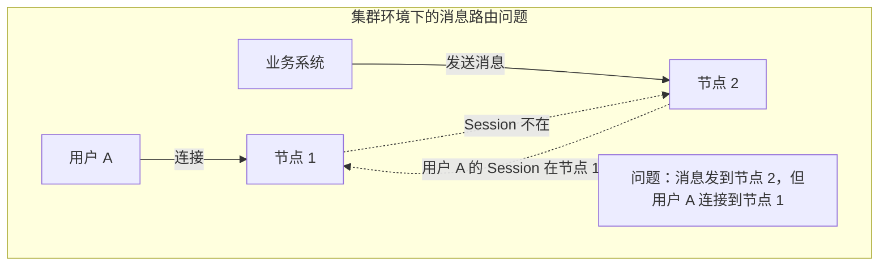
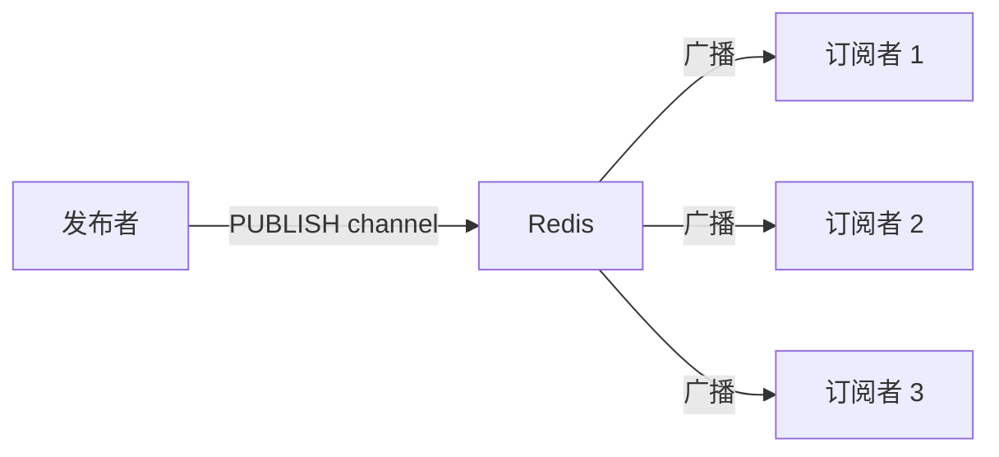
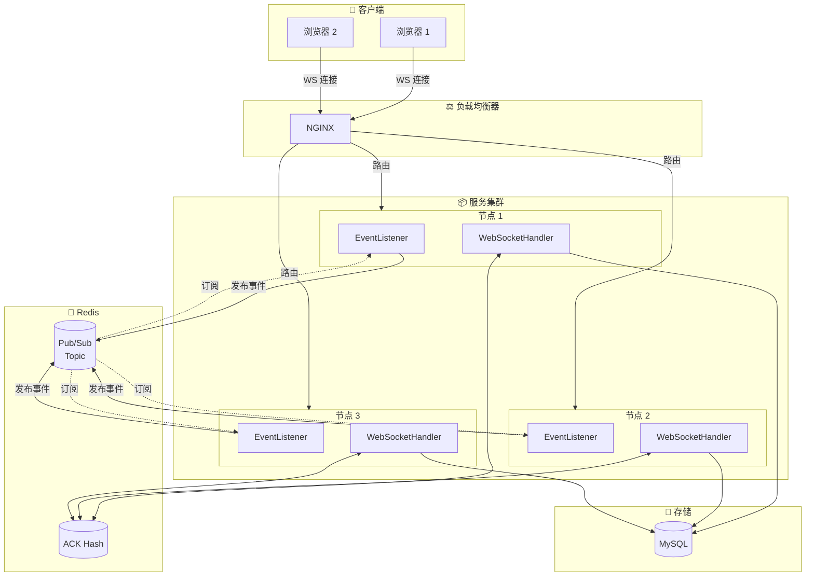
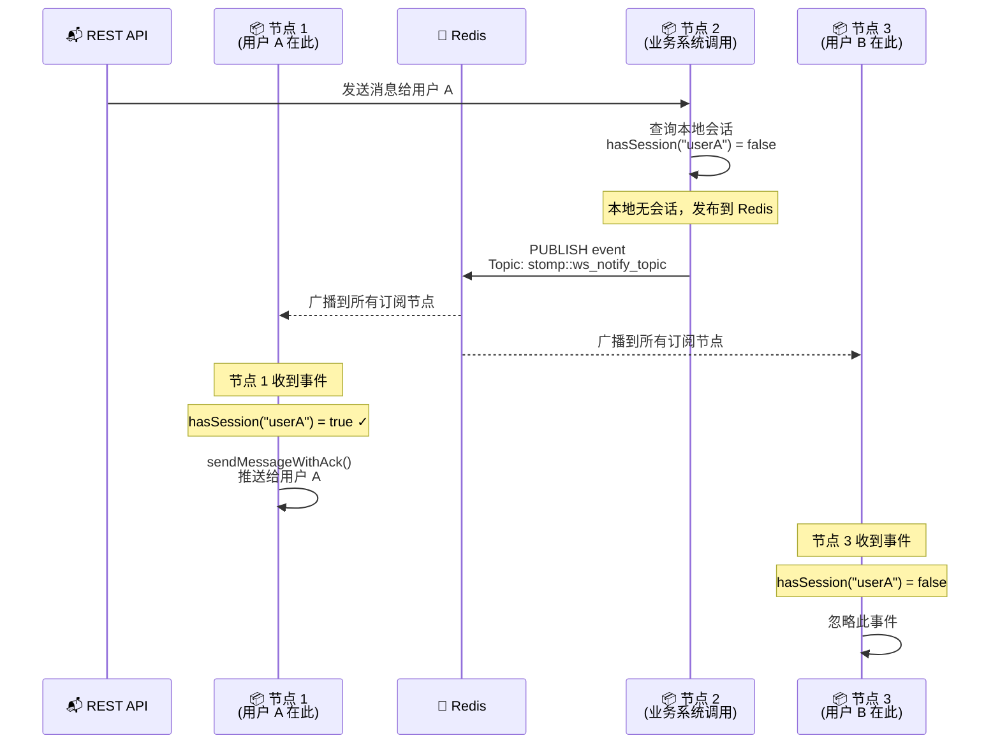

## 前言

单节点部署无法满足生产环境的高可用和横向扩展需求。本文将深入讲解 Quick-Notify 如何基于 Redis Pub/Sub 实现 WebSocket 集群，支持多节点水平扩展。

## 一、问题场景

### 1.1 集群环境下的消息路由问题



### 1.2 传统解决方案

| 方案 | 原理 | 缺点 |
|------|------|------|
| 会话粘性 | 用户固定连接到某个节点 | 故障转移困难 |
| 广播到所有节点 | 每个节点都推送 | 浪费资源，复杂度高 |
| 外部消息队列 | RabbitMQ/Kafka | 引入额外组件 |
| **Redis Pub/Sub** | 跨节点消息转发 | 简单高效 ✅ |

## 二、Redis Pub/Sub 原理

### 2.1 什么是 Pub/Sub



Pub/Sub（Publish/Subscribe）是 Redis 提供的**发布订阅**功能，支持：
- **发布者**：发送消息到指定频道
- **订阅者**：订阅一个或多个频道
- **多播**：一条消息可以发送给多个订阅者

### 2.2 Redis Pub/Sub 命令

```bash
# 订阅频道
SUBSCRIBE channel1 channel2

# 发布消息
PUBLISH channel1 "Hello World"

# 模式订阅
PSUBSCRIBE channel:*
```

## 三、集群架构设计

### 3.1 整体架构



### 3.2 消息流程



## 四、核心实现

### 4.1 NotifyMessageEvent

```java
/**
 * 消息事件
 * 注意：本地事件发布时携带 NotifyMessageLog 对象
 */
public record NotifyMessageEvent(NotifyMessageLog notifyMessageLog) {
    // 获取消息内容
    public NotifyMessageLog getMessage() {
        return notifyMessageLog;
    }
}
```

### 4.2 事件监听器（核心逻辑）

```java
@Slf4j
public class NotifyEventListener {

    private static final String NOTIFY_TOPIC = "stomp::ws_notify_topic";

    private StompWebSocketHandler stompWebSocketHandler;
    private RedissonClient redisson;

    /**
     * 处理 NotifyMessageEvent（@Async + AFTER_COMMIT）
     * 本地事件触发：发布到 Redis Topic
     * 远程事件触发：检查本地会话并推送
     */
    @Async
    @TransactionalEventListener(phase = TransactionPhase.AFTER_COMMIT)
    public void handler(NotifyMessageEvent event) {
        handlerEvent(event, true);  // isLocalEvent = true
    }

    private void handlerEvent(NotifyMessageEvent event, boolean isLocalEvent) {
        NotifyMessageLog msgLog = event.notifyMessageLog();

        if (isLocalEvent) {
            // 本地事件：直接发布到 Redis，让所有节点都能收到
            publishClusterEvent(event);
            return;
        }

        // 远程事件：检查本地是否有目标用户的会话
        if (stompWebSocketHandler.hasSession(msgLog.getReceiver())) {
            log.debug("[EventListener] 本地有会话, 推送消息, msgId: {}, receiver: {}",
                    msgLog.getId(), msgLog.getReceiver());
            stompWebSocketHandler.sendMessageWithAck(msgLog.toNotifyMessage());
        }
    }

    /**
     * 发布集群事件到 Redis Pub/Sub
     */
    private void publishClusterEvent(NotifyMessageEvent event) {
        RTopic topic = redisson.getTopic(NOTIFY_TOPIC);
        topic.publish(event);
    }

    /**
     * 订阅集群事件（启动时调用）
     */
    public void subscribeToTopic() {
        RTopic topic = redisson.getTopic(NOTIFY_TOPIC);
        topic.addListener(NotifyMessageEvent.class, (channel, event) -> {
            // 处理远程事件（isLocalEvent = false）
            handlerEvent(event, false);
        });
    }
}
```

**关键设计**：
- 本地事件（isLocalEvent=true）：发布到 Redis Topic → 所有节点收到
- 远程事件（isLocalEvent=false）：检查本地会话 → 有则推送，无则忽略

### 4.3 NotifyManager 编排

```java
public class NotifyManager {

    private final NotifyRepository repository;
    private final ApplicationEventPublisher eventPublisher;

    /**
     * 保存并发布消息
     * 1. 类型校验
     * 2. 设置时间戳
     * 3. 持久化到数据库
     * 4. 发布 Spring 事件（触发集群广播）
     */
    public NotifyMessageLog saveAndPublish(NotifyMessageLog msg) {
        MessageTypeRegistry.checkDataType(msg.getType(), msg.getData());

        if (msg.getCreated() == 0) {
            msg.setCreated(System.currentTimeMillis());
        }

        repository.save(msg);
        eventPublisher.publishEvent(new NotifyMessageEvent(msg));

        return msg;
    }
}
```

## 五、集群部署配置

### 5.1 Redis 配置

```yaml
# 单机 Redis
redisson:
  single-server-config:
    address: redis://127.0.0.1:6379

# Redis Sentinel（高可用）
redisson:
  sentinel-servers-config:
    sentinelAddresses:
      - redis://127.0.0.1:6379
      - redis://127.0.0.1:6378
      - redis://127.0.0.1:6377
    sentinelMasterName: my-master

# Redis Cluster
redisson:
  cluster-servers-config:
    nodeAddresses:
      - redis://127.0.0.1:6379
      - redis://127.0.0.1:6380
      - redis://127.0.0.1:6381
```

### 5.2 NGINX 配置

```nginx
# /etc/nginx/conf.d/websocket.conf

upstream websocket_backend {
    least_conn;  # 最少连接数负载均衡

    server 192.168.1.101:8080;
    server 192.168.1.102:8080;
    server 192.168.1.103:8080;
}

server {
    listen 80;
    server_name your-domain.com;

    # WebSocket 升级配置
    location /stomp-ws {
        proxy_pass http://websocket_backend;

        proxy_http_version 1.1;
        proxy_set_header Upgrade $http_upgrade;
        proxy_set_header Connection "upgrade";

        proxy_set_header Host $host;
        proxy_set_header X-Real-IP $remote_addr;
        proxy_set_header X-Forwarded-For $proxy_add_x_forwarded_for;

        # 超时配置
        proxy_read_timeout 3600s;
        proxy_send_timeout 3600s;
    }
}
```

### 5.3 Docker Compose 部署

```yaml
# docker-compose.yml
version: '3.8'

services:
  redis:
    image: redis:7-alpine
    ports:
      - "6379:6379"

  app:
    build: .
    ports:
      - "8080:8080"
    depends_on:
      - redis
    environment:
      - SPRING_REDIS_HOST=redis
      - SERVER_PORT=8080

  app2:
    build: .
    ports:
      - "8081:8080"
    depends_on:
      - redis
    environment:
      - SPRING_REDIS_HOST=redis
      - SERVER_PORT=8080

  nginx:
    image: nginx:alpine
    ports:
      - "80:80"
    volumes:
      - ./nginx.conf:/etc/nginx/conf.d/default.conf
    depends_on:
      - app
      - app2
```

## 六、高可用设计

### 6.1 故障转移

```
                    ┌─────────────────────────────────┐
                    │         故障转移流程              │
                    └─────────────────────────────────┘

1. 用户 A 连接到节点 1
   └── Session: userA@sess_001 @ Node1

2. 节点 1 故障
   └── 用户 A 连接断开

3. 负载均衡器检测到节点 1 不可用
   └── 自动将新连接路由到节点 2/3

4. 用户 A 重连
   └── Session: userA@sess_002 @ Node2

5. 后续消息通过 Redis Pub/Sub 路由到节点 2
```

### 6.2 消息不丢失保障

```
┌─────────────────────────────────────────────────────────────────┐
│                      消息持久化保障                               │
├─────────────────────────────────────────────────────────────────┤
│                                                                 │
│  1. 消息先持久化到 MySQL，再发送                                  │
│     └── 即使节点故障，消息不会丢失                                │
│                                                                 │
│  2. ACK 记录存储在 Redis                                         │
│     └── 多节点共享，任意节点可处理 ACK                           │
│                                                                 │
│  3. 节点恢复后，定时任务重试未确认消息                            │
│     └── 补偿机制确保消息最终送达                                  │
│                                                                 │
└─────────────────────────────────────────────────────────────────┘
```

## 七、性能优化

### 7.1 连接数优化

```yaml
# Tomcat 连接配置
server:
  tomcat:
    threads:
      max: 200        # 最大工作线程数
      min-spare: 10   # 最小空闲线程

# Redis 连接池
redisson:
  connection-pool-size: 64
  connection-minimum-idle-size: 24
```

### 7.2 消息压缩

```yaml
# application.yml
server:
  compression:
    enabled: true
    mime-types: application/json,application/xml,text/html,text/xml,text/plain
```

### 7.3 批量处理

```java
// 定时批量处理 ACK
@Scheduled(fixedDelay = 1000)
public void batchProcessAck() {
    List<String> keysToRemove = new ArrayList<>();

    for (String key : pendingMessages.keySet()) {
        if (canRemove(key)) {
            keysToRemove.add(key);
        }
    }

    // 批量删除
    if (!keysToRemove.isEmpty()) {
        redisson.getKeys().delete(keysToRemove.toArray(new String[0]));
    }
}
```

## 八、监控指标

### 8.1 Redis 关键指标

```bash
# 待确认消息数
DBSIZE  # 或者 SCARD stomp::pending_messages

# 订阅者数量
PUBSUB NUMSUB stomp::ws_notify_topic

# 内存使用
INFO memory | grep used_memory_human
```

### 8.2 日志监控

```
# 事件发布
[EventListener] 发布集群事件, msgId: xxx, receiver: userA

# 事件接收
[EventListener] 收到集群事件, msgId: xxx, receiver: userA

# 消息推送
[EventListener] 本地有会话, 推送消息, msgId: xxx, receiver: userA

# 忽略（本地无会话）
[EventListener] 本地无会话, 忽略, msgId: xxx, receiver: userB
```

## 九、常见问题

### Q1: Redis 挂了怎么办？

**问题**：Redis 故障导致 Pub/Sub 和 ACK 都不可用

**解决**：
1. 使用 Redis Sentinel 或 Cluster 保证 Redis 高可用
2. 本地缓存降级：启用 `enableLocalAck = true`
3. 消息持久化到 MySQL，节点恢复后重试

### Q2: 消息重复怎么办？

**问题**：Pub/Sub 不保证Exactly-Once

**解决**：客户端实现幂等处理（见第四章）

### Q3: 如何保证消息顺序？

**问题**：多节点并发处理可能导致乱序

**解决**：
1. 消息携带序列号
2. 客户端按序列号排序
3. 使用 Redis Stream 替代 Pub/Sub（需要 Redis 5.0+）

## 十、总结

本文深入讲解了 Quick-Notify 的集群方案：

- **基于 Redis Pub/Sub**：实现跨节点消息转发
- **本地优先**：有会话直接推送，无会话才广播
- **高可用**：支持 Redis Sentinel/Cluster
- **消息不丢失**：持久化 + ACK 双重保障

---

## 下一步

- 📱 [多设备同步与幂等性](./06-multi-device-sync.md)
- 🛠️ [生产环境部署](./07-production-deployment.md)
- 🔐 [Token 认证安全](./08-security-authentication.md)
