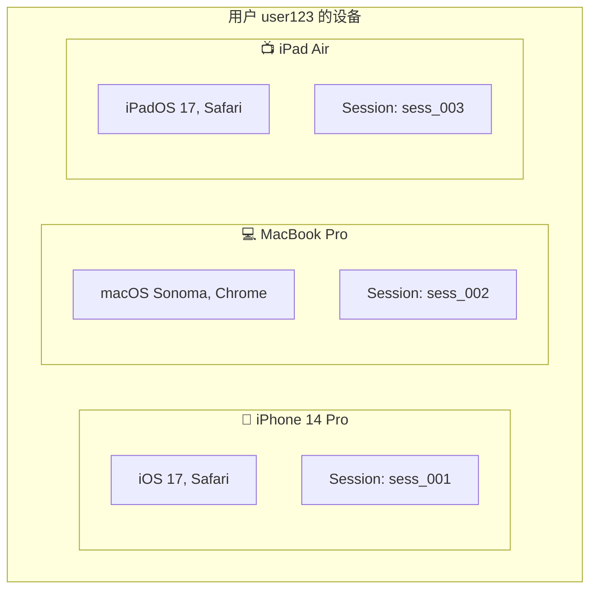
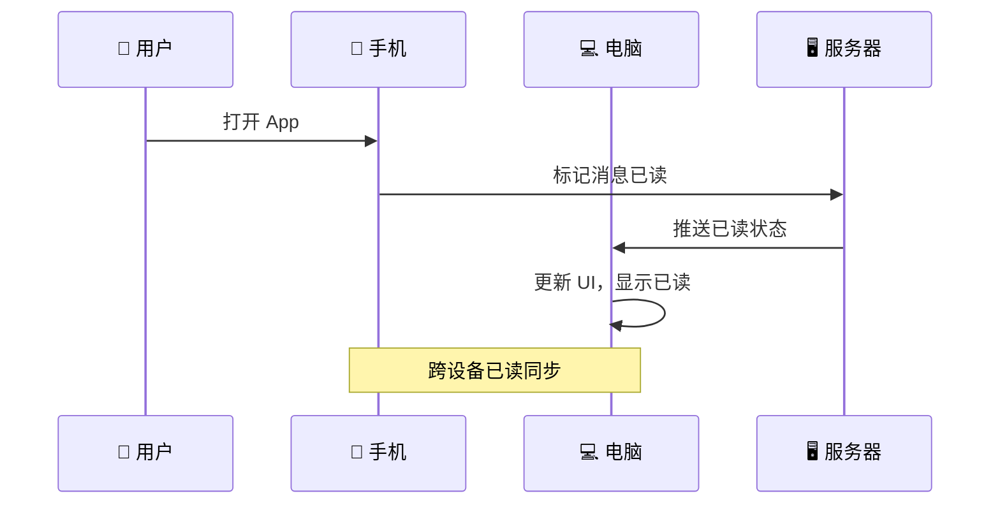

## 前言

现代用户通常同时使用多个设备：手机、电脑、平板。多设备场景下的消息同步是一个复杂问题：消息是否需要同时送达所有设备？设备 A 确认了，设备 B 是否还需要确认？本文将深入讲解 Quick-Notify 的多设备同步策略。

## 一、多设备场景分析

### 1.1 典型场景



### 1.2 同步需求

| 消息类型 | 同步策略 |
|---------|---------|
| 即时消息（聊天） | 所有设备同时收到 |
| 系统通知 | 所有设备同时收到 |
| 已读状态 | 跨设备同步 |
| 订单状态 | 所有设备收到，用户只需处理一次 |

## 二、多设备消息投递

### 2.1 投递策略

```mermaid
graph TB
    subgraph Server [服务器]
        Handler[StompWebSocketHandler]
    end

    subgraph User [用户 user123]
        Device1[📱 iPhone]
        Device2[💻 Mac]
        Device3[📺 iPad]
    end

    Handler -->|"msg_001 → sess_001"| Device1
    Handler -->|"msg_001 → sess_002"| Device2
    Handler -->|"msg_001 → sess_003"| Device3

    Note over Handler: 每设备独立 ACK 记录
```

### 2.2 核心实现

```java
public void sendMessageWithAck(NotifyMessage message) {
    SimpUser user = userRegistry.getUser(message.getReceiver());

    if (user != null && user.hasSessions()) {
        List<SimpSession> sessions = new ArrayList<>(user.getSessions());

        log.info("[多设备] 开始推送, msgId: {}, receiver: {}, 设备数: {}",
                message.getId(), message.getReceiver(), sessions.size());

        for (SimpSession session : sessions) {
            // 每个设备独立创建 ACK 记录
            addAckMessageRecord(message, session.getId());
            // 每个设备独立发送消息
            sendMessage(message, session.getId());

            log.info("[多设备] 已发送到设备, msgId: {}, sessionId: {}, 设备: {}",
                    message.getId(), session.getId(), session.getSessionId());
        }
    }
}
```

### 2.3 日志分析

```
# 服务器日志
[多设备] 开始推送, msgId: msg_001, receiver: user123, 设备数: 3
[ACK-REDIS] 消息入队, msgId msg_001, sessionId sess_001, receiver user123
[ACK-REDIS] 消息入队, msgId msg_001, sessionId sess_002, receiver user123
[ACK-REDIS] 消息入队, msgId msg_001, sessionId sess_003, receiver user123

# 客户端 ACK
[ACK-REDIS] 确认成功, msgId msg_001, sessionId sess_001, retryCount 0  # iPhone 确认
[ACK-REDIS] 确认成功, msgId msg_001, sessionId sess_002, retryCount 0  # Mac 确认
[ACK-REDIS] 确认成功, msgId msg_001, sessionId sess_003, retryCount 0  # iPad 确认
```

## 三、幂等性处理

### 3.1 为什么需要幂等

```
┌─────────────────────────────────────────────────────────────────┐
│                      消息重复场景                                 │
├─────────────────────────────────────────────────────────────────┤
│                                                                 │
│  1. ACK 超时重发                                                 │
│     ─────────────────────────────────────────────────────────   │
│     消息已送达，但 ACK 未收到，服务器重发消息                       │
│                                                                 │
│  2. 多设备同步                                                   │
│     ─────────────────────────────────────────────────────────   │
│     同一消息同时发送到多个设备，每个设备都会收到                    │
│                                                                 │
│  3. 用户快速重连                                                 │
│     ─────────────────────────────────────────────────────────   │
│     断线重连 3 秒内，服务器可能重发期间积压的消息                   │
│                                                                 │
└─────────────────────────────────────────────────────────────────┘
```

### 3.2 客户端幂等处理

```javascript
class MessageHandler {
    constructor() {
        // 已处理消息 ID 集合
        this.processedMessages = new Map();  // messageId → timestamp

        // 清理阈值（1 小时）
        this.CLEANUP_THRESHOLD = 3600000;
    }

    /**
     * 处理收到的消息
     */
    handleMessage(message) {
        const messageId = message.id;
        const now = Date.now();

        // 1. 检查是否已处理过
        if (this.processedMessages.has(messageId)) {
            console.log(`[幂等] 跳过重复消息: ${messageId}`);
            // 仍需发送 ACK（否则会一直重发）
            this.sendAck(messageId);
            return;
        }

        // 2. 标记为已处理
        this.processedMessages.set(messageId, now);

        // 3. 执行业务逻辑
        this.processBusinessLogic(message);

        // 4. 发送 ACK
        this.sendAck(messageId);

        // 5. 定期清理过期记录
        this.cleanup();
    }

    /**
     * 业务逻辑处理
     */
    processBusinessLogic(message) {
        switch (message.type) {
            case 'ORDER_STATUS':
                this.handleOrderStatus(message.data);
                break;
            case 'CHAT_MESSAGE':
                this.handleChatMessage(message.data);
                break;
            case 'NOTIFICATION':
                this.handleNotification(message.data);
                break;
            default:
                console.warn('未知消息类型:', message.type);
        }
    }

    /**
     * 发送 ACK 确认
     */
    sendAck(messageId) {
        stompClient.send('/app/ack', {}, messageId);
    }

    /**
     * 清理过期记录
     */
    cleanup() {
        const now = Date.now();
        for (const [messageId, timestamp] of this.processedMessages.entries()) {
            if (now - timestamp > this.CLEANUP_THRESHOLD) {
                this.processedMessages.delete(messageId);
            }
        }
    }
}

// 使用示例（在 connect 回调中执行）
const handler = new MessageHandler();

stompClient.subscribe('/user/queue/msg', function(message) {
    const data = JSON.parse(message.body);
    handler.handleMessage(data);
});
```

### 3.3 Vue3 组合式实现

```javascript
// composables/useMessageHandler.js
import { ref, onMounted, onUnmounted } from 'vue';

export function useMessageHandler() {
    const processedIds = ref(new Set());
    const CLEANUP_INTERVAL = 60000;  // 1 分钟清理

    let cleanupTimer = null;

    const handleMessage = (message) => {
        if (processedIds.value.has(message.id)) {
            console.log('重复消息，跳过:', message.id);
            sendAck(message.id);
            return;
        }

        processedIds.value.add(message.id);
        processMessage(message);
        sendAck(message.id);
    };

    const processMessage = (message) => {
        switch (message.type) {
            case 'ORDER_STATUS':
                handleOrderStatus(message.data);
                break;
            case 'CHAT_MESSAGE':
                handleChatMessage(message.data);
                break;
            default:
                console.warn('未知类型:', message.type);
        }
    };

    const sendAck = (messageId) => {
        stompClient.send('/app/ack', {}, messageId);
    };

    const cleanup = () => {
        if (processedIds.value.size > 1000) {
            processedIds.value = new Set();
        }
    };

    onMounted(() => {
        cleanupTimer = setInterval(cleanup, CLEANUP_INTERVAL);
    });

    onUnmounted(() => {
        if (cleanupTimer) {
            clearInterval(cleanupTimer);
        }
    });

    return {
        handleMessage,
        processedIds
    };
}
```

## 四、已读状态同步

### 4.1 已读同步流程



### 4.2 服务端实现

```java
/**
 * 标记消息已读
 */
public void markMessagesAsRead(String userId, List<String> messageIds) {
    // 1. 更新数据库
    repository.updateViewedTrueByReceiverAndIdIn(userId, messageIds);

    // 2. 推送已读状态到其他设备
    NotifyMessageLog notify = NotifyMessageLog.builder()
        .type(NotifyType.NOTIFY_VIEWED.name())
        .data(NotifyType.NotifyUpdateRsp.builder()
            .ids(messageIds)
            .viewed(true)
            .build())
        .receiver(userId)
        .build();

    // 3. 发布事件（不持久化，仅推送）
    publish(notify);
}

/**
 * 推送删除状态
 */
public void markMessagesDeleted(String userId, List<String> messageIds) {
    NotifyMessageLog notify = NotifyMessageLog.builder()
        .type(NotifyType.NOTIFY_DELETED.name())
        .data(NotifyType.NotifyUpdateRsp.builder()
            .ids(messageIds)
            .deleted(true)
            .build())
        .receiver(userId)
        .build();

    publish(notify);
}
```

### 4.3 客户端处理

```javascript
// 在 connect 回调中执行
stompClient.subscribe('/user/queue/msg', function(message) {
    const data = JSON.parse(message.body);

    switch (data.type) {
        case 'NOTIFY_VIEWED':
            // 更新消息状态为已读
            data.data.ids.forEach(id => {
                updateMessageStatus(id, { viewed: true });
            });
            break;

        case 'NOTIFY_DELETED':
            // 删除消息
            data.data.ids.forEach(id => {
                removeMessage(id);
            });
            break;

        default:
            // 普通消息
            handleMessage(data);
    }

    stompClient.send('/app/ack', {}, data.id);
});
```

## 五、消息时间戳处理

### 5.1 时间戳同步

```javascript
class TimeSynchronizer {
    constructor() {
        this.serverTimeOffset = 0;
    }

    /**
     * 同步服务器时间
     */
    async syncTime() {
        const before = Date.now();
        const response = await fetch('/api/time');
        const after = Date.now();

        const serverTime = await response.json();
        const roundTrip = after - before;

        // 计算时间偏移
        this.serverTimeOffset = serverTime.timestamp - (before + roundTrip / 2);

        console.log(`[时间同步] 偏移量: ${this.serverTimeOffset}ms`);
    }

    /**
     * 获取校正后的时间
     */
    now() {
        return Date.now() + this.serverTimeOffset;
    }

    /**
     * 处理消息时间戳
     */
    processMessageTimestamp(message) {
        return {
            ...message,
            correctedTime: message.timestamp + this.serverTimeOffset
        };
    }
}
```

### 5.2 消息排序

```javascript
class MessageSorter {
    constructor() {
        this.messages = [];
    }

    /**
     * 添加消息并保持顺序
     */
    addMessage(message) {
        const timestamp = message.timestamp || Date.now();

        // 二分查找插入位置
        let left = 0;
        let right = this.messages.length;

        while (left < right) {
            const mid = Math.floor((left + right) / 2);
            if (this.messages[mid].timestamp < timestamp) {
                left = mid + 1;
            } else {
                right = mid;
            }
        }

        this.messages.splice(left, 0, message);
    }

    /**
     * 获取消息列表
     */
    getMessages() {
        return [...this.messages];
    }
}
```

## 六、连接状态管理

### 6.1 多设备状态追踪

```javascript
class DeviceManager {
    constructor() {
        this.devices = new Map();  // sessionId → deviceInfo
    }

    /**
     * 连接建立
     */
    onConnect(sessionId, deviceInfo) {
        this.devices.set(sessionId, {
            ...deviceInfo,
            connectedAt: Date.now(),
            lastActive: Date.now()
        });

        console.log(`[设备] 连接, sessionId: ${sessionId}`, deviceInfo);
        this.notifyDeviceChange();
    }

    /**
     * 连接断开
     */
    onDisconnect(sessionId) {
        this.devices.delete(sessionId);
        console.log(`[设备] 断开, sessionId: ${sessionId}`);
        this.notifyDeviceChange();
    }

    /**
     * 活动状态更新
     */
    onActivity(sessionId) {
        const device = this.devices.get(sessionId);
        if (device) {
            device.lastActive = Date.now();
        }
    }

    /**
     * 获取在线设备数
     */
    getOnlineCount() {
        return this.devices.size;
    }

    /**
     * 获取设备列表
     */
    getDeviceList() {
        return Array.from(this.devices.values());
    }
}
```

### 6.2 订阅生命周期

```javascript
class SubscriptionManager {
    constructor() {
        this.subscriptions = new Map();
        this.stompClient = null;
    }

    /**
     * 初始化
     */
    init(stompClient) {
        this.stompClient = stompClient;
    }

    /**
     * 订阅消息
     */
    subscribe() {
        if (!this.stompClient) {
            throw new Error('STOMP 客户端未初始化');
        }

        const subscription = this.stompClient.subscribe('/user/queue/msg',
            (message) => {
                const data = JSON.parse(message.body);
                this.onMessage(data);
            },
            {
                id: 'msg-subscription',
                ack: 'client'  // 客户端确认模式
            }
        );

        this.subscriptions.set('msg-subscription', subscription);
    }

    /**
     * 取消订阅
     */
    unsubscribe() {
        this.subscriptions.forEach((sub, key) => {
            sub.unsubscribe();
        });
        this.subscriptions.clear();
    }

    /**
     * 消息处理
     */
    onMessage(message) {
        // 触发回调
    }
}
```

## 七、最佳实践

### 7.1 消息 ID 生成

```java
// 服务端生成唯一 ID
public class IdGenerator {
    // 雪花算法（推荐）
    // 或使用：UUID + 时间戳组合
}
```

### 7.2 本地存储

```javascript
// IndexedDB 存储离线消息
class OfflineMessageStore {
    constructor() {
        this.db = null;
    }

    async init() {
        this.db = await openDatabase('quick-notify', 1);
    }

    async save(message) {
        await this.db.messages.add({
            ...message,
            storedAt: Date.now()
        });
    }

    async getPending() {
        return this.db.messages
            .where('status')
            .equals('pending')
            .toArray();
    }
}
```

### 7.3 网络状态处理

```javascript
class NetworkStateHandler {
    constructor() {
        this.isOnline = navigator.onLine;

        window.addEventListener('online', () => {
            this.isOnline = true;
            this.onReconnect();
        });

        window.addEventListener('offline', () => {
            this.isOnline = false;
            this.onDisconnect();
        });
    }

    onReconnect() {
        console.log('[网络] 已恢复');
        // 重新订阅
        // 拉取离线消息
    }

    onDisconnect() {
        console.log('[网络] 已断开');
        // 显示离线状态
        // 缓存消息到本地
    }
}
```

## 八、总结

本文深入讲解了多设备消息同步与幂等性处理：

- **多设备投递**：每个设备独立 ACK 记录
- **幂等处理**：客户端基于消息 ID 去重
- **已读同步**：跨设备状态同步
- **时间戳同步**：确保消息顺序正确
- **连接管理**：多设备状态追踪

---

## 下一步

- 🛠️ [生产环境部署](./07-production-deployment.md)
- 🔐 [Token 认证安全](./08-security-authentication.md)
- ⚡ [性能优化](./09-performance-optimization.md)
