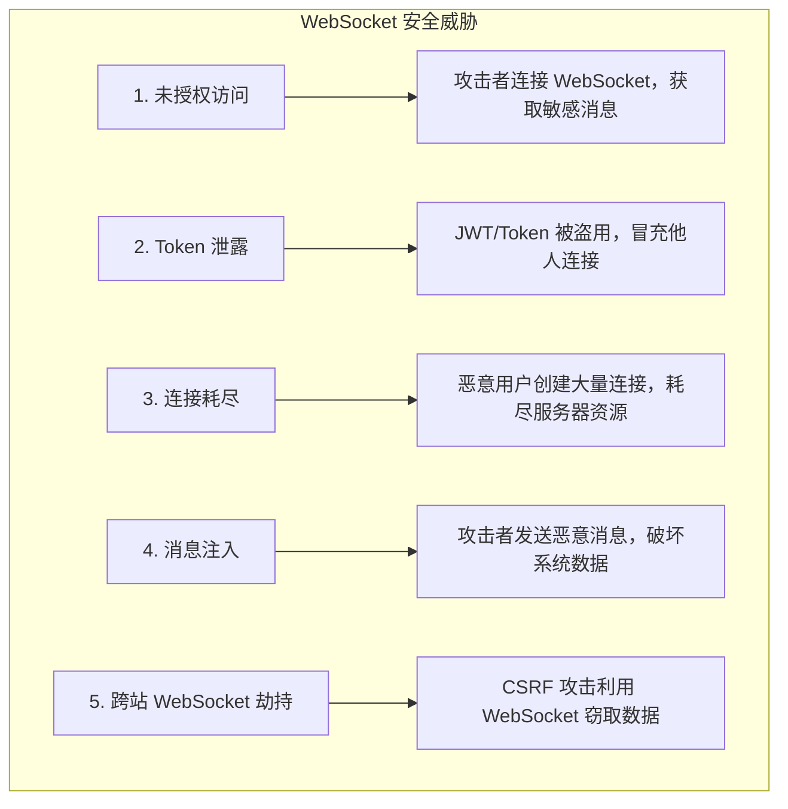
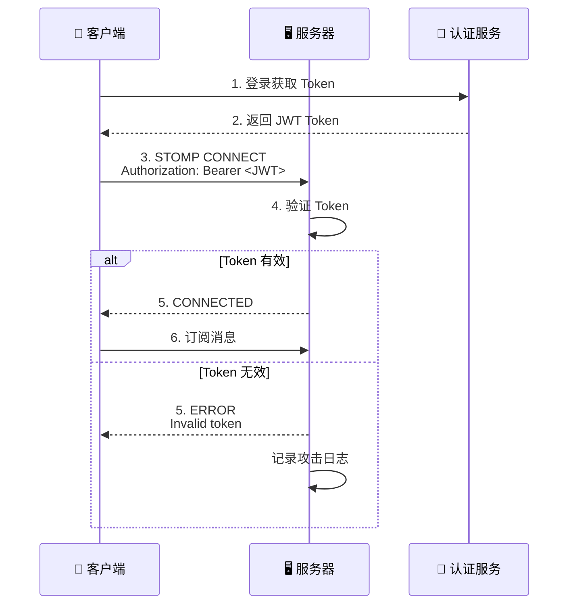

## 前言

WebSocket 连接的安全是一个重要课题。与 HTTP 请求不同，WebSocket 是持久连接，一旦被滥用，后果更严重。本文将深入讲解 Quick-Notify 的安全机制。

## 一、安全威胁分析

### 1.1 主要威胁



### 1.2 防护措施总览

| 威胁 | 防护措施 |
|------|---------|
| 未授权访问 | Token 认证 + 签名验证 |
| Token 泄露 | 短期 Token + HTTPS |
| 连接耗尽 | 每用户连接数限制 |
| 消息注入 | 输入校验 + 消息类型白名单 |
| CSRF | Origin 校验 + CSRF Token |

## 二、Token 认证机制

### 2.1 认证流程



### 2.2 拦截器实现

```java
public class StompWebsocketInterceptor implements ChannelInterceptor {

    private final ObjectProvider<SimpUserRegistry> userRegistryProvider;

    @Override
    public Message<?> preSend(Message<?> message, MessageChannel channel) {
        StompHeaderAccessor accessor = MessageHeaderAccessor.getAccessor(
            message, StompHeaderAccessor.class);

        if (accessor != null && StompCommand.CONNECT.equals(accessor.getCommand())) {
            // 1. 提取 Token
            String userId;
            try {
                userId = extractUserId(accessor);
            } catch (Exception e) {
                log.error("Token 验证失败: {}", e.getMessage());
                throw new IllegalStateException("Invalid token");
            }

            // 2. 校验 Token 有效性
            if (userId == null || userId.isBlank()) {
                log.error("Token 为空");
                throw new IllegalStateException("Token is required");
            }

            // 3. 校验连接数限制
            checkConnectionLimit(userId);

            // 4. 绑定用户身份
            accessor.setUser(new MyPrincipal(userId));

            log.info("用户 {} 连接成功, sessionId: {}",
                userId, accessor.getSessionId());
        }

        return message;
    }

    /**
     * 提取用户 ID（可被子类重写）
     */
    protected String extractUserId(StompHeaderAccessor accessor) {
        List<String> headers = accessor.getNativeHeader("Authorization");
        if (headers == null || headers.isEmpty()) {
            throw new IllegalStateException("Authorization header not found");
        }

        String token = headers.get(0);

        // 开发环境：test 前缀直接作为用户 ID
        if (token.startsWith("test")) {
            return token;
        }

        // 生产环境：解析 JWT（需子类重写实现）
        return parseJwtAndExtractUserId(token);
    }

    /**
     * 解析 JWT（子类重写）
     */
    protected String parseJwtAndExtractUserId(String token) {
        // 默认实现返回原 token
        // 生产环境应重写此方法实现真正的 JWT 解析
        return token;
    }
}
```

### 2.3 JWT 解析示例

```java
public class JwtWebsocketInterceptor extends StompWebsocketInterceptor {

    private JwtDecoder jwtDecoder;

    public void setJwtDecoder(JwtDecoder jwtDecoder) {
        this.jwtDecoder = jwtDecoder;
    }

    @Override
    protected String parseJwtAndExtractUserId(String token) {
        try {
            // 移除 "Bearer " 前缀
            if (token.startsWith("Bearer ")) {
                token = token.substring(7);
            }

            // 解析 JWT
            Jwt jwt = jwtDecoder.decode(token);

            // 提取用户 ID（根据 JWT claim 名）
            String userId = jwt.getClaimAsString("sub");

            if (userId == null || userId.isBlank()) {
                throw new IllegalStateException("Invalid token: missing user ID");
            }

            return userId;

        } catch (Exception e) {
            log.error("JWT 解析失败: {}", e.getMessage());
            throw new IllegalStateException("Invalid token");
        }
    }
}
```

## 三、连接数限制

### 3.1 限制策略

```java
private void checkConnectionLimit(String userId) {
    SimpUserRegistry registry = userRegistryProvider.getIfAvailable();

    if (registry == null) {
        return;  // 单机模式，跳过检查
    }

    // 获取用户所有会话
    SimpUser user = registry.getUser(userId);
    List<String> existingSessions = Optional.ofNullable(user)
        .map(SimpUser::getSessions)
        .map(sessions -> sessions.stream()
            .map(SimpSession::getId)
            .toList())
        .orElse(List.of());

    // 校验连接数限制（每人最多 10 个连接）
    if (existingSessions.size() >= 10) {
        log.error("用户 {} 连接数超限, 当前: {}, 限制: {}",
            userId, existingSessions.size(), 10);
        throw new IllegalStateException("连接数超限，请关闭其他设备后重试");
    }
}
```

### 3.2 动态配置

```java
@ConfigurationProperties(prefix = "quick.notify")
public class QuickNotifyProperties {

    /** 每用户最大连接数 */
    private int maxConnectionsPerUser = 10;

    /** 是否启用连接数限制 */
    private boolean connectionLimitEnabled = true;
}
```

## 四、CORS 跨域配置

### 4.1 生产环境配置

```java
@Override
public void registerStompEndpoints(StompEndpointRegistry registry) {
    registry.addEndpoint("/stomp-ws")
        // 生产环境：指定具体域名
        .setAllowedOriginPatterns(
            "https://your-domain.com",
            "https://www.your-domain.com"
        )
        .withSockJS()
        .setHeartbeatTime(10000)
        .setDisconnectDelay(30000);
}
```

### 4.2 开发环境配置

```java
// 开发环境允许所有来源
.setAllowedOriginPatterns("*")

// ⚠️ 生产环境禁止使用 * ！
```

## 五、消息安全

### 5.1 消息类型白名单

```java
public enum NotifyType {
    STRING_MSG(String.class),
    NOTIFY_VIEWED(NotifyUpdateRsp.class),
    NOTIFY_DELETED(NotifyUpdateRsp.class),
    ORDER_STATUS(OrderStatusData.class);

    // 添加新类型需要显式注册
}
```

### 5.2 输入校验

```java
public void sendMessage(NotifyMessage message, String sessionId) {
    // 1. 校验消息长度
    if (message.getData() != null) {
        String json = JsonUtils.toJson(message.getData());
        if (json.length() > 64 * 1024) {  // 64KB
            throw new IllegalArgumentException("消息内容过大");
        }
    }

    // 2. 校验接收者
    if (message.getReceiver() == null || message.getReceiver().isBlank()) {
        throw new IllegalArgumentException("接收者不能为空");
    }

    // 3. XSS 过滤
    if (containsXssContent(message.getData())) {
        throw new IllegalArgumentException("消息内容包含非法字符");
    }
}
```

## 六、HTTPS/WSS 配置

### 6.1 服务器配置

```yaml
server:
  ssl:
    enabled: true
    key-store: classpath:keystore.p12
    key-store-password: ${SSL_PASSWORD}
    key-store-type: PKCS12
    key-alias: quick-notify
  port: 8443
```

### 6.2 Nginx WSS 配置

```nginx
server {
    listen 443 ssl;
    server_name your-domain.com;

    ssl_certificate /etc/nginx/ssl/server.crt;
    ssl_certificate_key /etc/nginx/ssl/server.key;
    ssl_protocols TLSv1.2 TLSv1.3;
    ssl_ciphers HIGH:!aNULL:!MD5;

    location /stomp-ws {
        proxy_pass https://backend;

        proxy_http_version 1.1;
        proxy_set_header Upgrade $http_upgrade;
        proxy_set_header Connection "upgrade";

        # WebSocket 必需的头部
        proxy_set_header X-Forwarded-Proto $scheme;
    }
}
```

### 6.3 客户端连接

```javascript
// WSS 连接（生产环境）
const stompClient = Stomp.over(
    new SockJS('https://your-domain.com/stomp-ws')
);

// 禁用自动回退到 HTTP
stompClient.sockJSProtocols = ['xhr-streaming', 'xhr-polling'];
```

## 七、安全日志

### 7.1 审计日志

```java
// 安全事件日志
log.warn("[SECURITY] Token 验证失败, ip: {}, token: {}, error: {}",
    getClientIp(), maskToken(token), error.getMessage());

log.warn("[SECURITY] 连接数超限, userId: {}, current: {}, max: {}",
    userId, currentCount, maxLimit);

log.warn("[SECURITY] 异常连接尝试, ip: {}, sessionId: {}",
    getClientIp(), sessionId);
```

### 7.2 日志脱敏

```java
private String maskToken(String token) {
    if (token == null || token.length() < 10) {
        return "***";
    }
    return token.substring(0, 4) + "***" + token.substring(token.length() - 4);
}
```

## 八、Spring Security 集成

### 8.1 配置类

```java
@Configuration
@EnableWebSocketMessageBroker
public class WebSocketSecurityConfig implements WebSocketMessageBrokerConfigurer {

    @Override
    public void configureClientInboundChannel(ChannelRegistration registration) {
        registration.interceptors(new JwtWebsocketInterceptor());
    }

    // 禁用 CSRF（STOMP 已经通过 Token 认证）
    @Override
    public void addArgumentResolvers(List<HandlerMethodArgumentResolver> resolvers) {
        // 自定义参数解析器
    }
}
```

### 8.2 Spring Boot 配置

```yaml
spring:
  security:
    enabled: true
  websocket:
    allowed-origins: https://your-domain.com
```

## 九、最佳实践清单

```
┌─────────────────────────────────────────────────────────────────┐
│                    WebSocket 安全检查清单                         │
├─────────────────────────────────────────────────────────────────┤
│                                                                 │
│  ✅ 使用 WSS（HTTPS + WebSocket）                                │
│  ✅ 所有连接必须认证（无匿名访问）                                 │
│  ✅ Token 短期有效，定期刷新                                      │
│  ✅ 每用户连接数限制（建议 5-10 个）                              │
│  ✅ 消息大小限制（建议 64KB 以内）                                │
│  ✅ 输入校验和 XSS 过滤                                          │
│  ✅ 生产环境 CORS 白名单                                          │
│  ✅ 安全日志记录                                                 │
│  ✅ 定期安全审计                                                 │
│                                                                 │
└─────────────────────────────────────────────────────────────────┘
```

## 十、总结

本文介绍了 Quick-Notify 的安全机制：

- **Token 认证**：JWT + Bearer Token
- **连接数限制**：每用户最多 10 个连接
- **CORS 配置**：生产环境白名单
- **消息安全**：类型白名单 + 输入校验
- **传输安全**：WSS + HTTPS

---

## 下一步

- ⚡ [性能优化](./09-performance-optimization.md)
- 📝 [最佳实践汇总](./10-best-practices.md)
