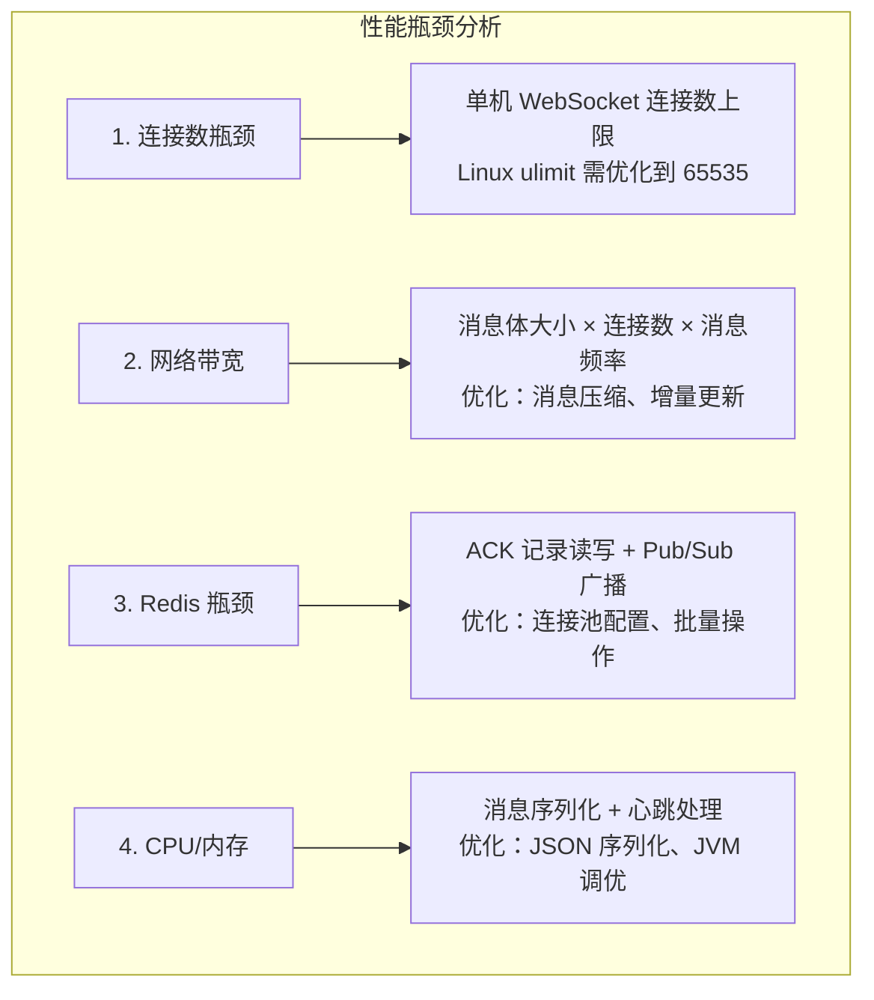

## 前言

在生产环境中，WebSocket 服务可能面临高并发挑战：万级用户同时在线，每秒处理数万条消息。本文将深入讲解 Quick-Notify 的性能优化策略。

## 一、性能瓶颈分析

### 1.1 常见瓶颈点



### 1.2 性能指标目标

| 指标 | 目标值 | 说明 |
|------|--------|------|
| 单机连接数 | 10,000+ | WebSocket 连接 |
| 消息延迟 | < 50ms | P99 |
| 消息吞吐 | 5,000+ msg/s | 单机 |
| CPU 利用率 | < 70% | 峰值 |

## 二、连接数优化

### 2.1 Linux 系统参数

```bash
# /etc/security/limits.conf
* soft nofile 65535
* hard nofile 65535

# /etc/sysctl.conf
fs.file-max = 655350
net.core.somaxconn = 65535
net.ipv4.tcp_max_syn_backlog = 65535

# 生效
sysctl -p
```

### 2.2 Tomcat 配置

```yaml
server:
  port: 8080
  tomcat:
    threads:
      max: 500          # 最大工作线程
      min-spare: 50     # 最小空闲线程
    max-connections: 10000
    accept-count: 200   # 等待队列长度
```

### 2.3 Redis 连接池

```yaml
redisson:
  connection-pool-size: 64       # 连接池大小
  connection-minimum-idle-size: 24 # 最小空闲连接
  idle-connection-timeout: 10000   # 空闲超时
  connect-timeout: 10000           # 连接超时
  timeout: 3000                    # 命令超时
  retry-attempts: 3               # 重试次数
  retry-interval: 1500            # 重试间隔
```

## 三、消息压缩

### 3.1 启用压缩

```yaml
server:
  compression:
    enabled: true
    mime-types: application/json,application/xml,text/html,text/xml,text/plain
    min-response-size: 1024  # 超过 1KB 才压缩
```

### 3.2 消息体优化

```java
// ❌ 不推荐：包含大量冗余字段
public class NotifyMessage {
    private String id;
    private String type;
    private String receiver;
    private String senderName;      // 不必要
    private String senderAvatar;    // 不必要
    private String messageTitle;   // 不必要
    private Object data;
    private long timestamp;
    private Map<String, String> metadata;  // 避免使用 Map
}

// ✅ 推荐：精简字段
public class NotifyMessage {
    private String id;
    private String type;
    private String receiver;
    private Object data;
    private long timestamp;
}
```

### 3.3 增量更新

```javascript
// ❌ 全量更新
{
    "type": "UPDATE_ORDER",
    "data": {
        "orderId": "ORD_001",
        "status": "PAID",
        "amount": 100.00,
        "items": [...],        // 完整列表
        "address": {...},      // 完整地址
        "paymentInfo": {...}   // 完整支付信息
    }
}

// ✅ 增量更新
{
    "type": "UPDATE_ORDER",
    "data": {
        "orderId": "ORD_001",
        "changes": {
            "status": "PAID"
        }
    }
}
```

## 四、心跳优化

### 4.1 合理的心跳间隔

```java
// 太短：浪费资源，容易误判断连
.setHeartbeatValue(new long[]{5000, 5000});

// 太长：断连检测不及时
.setHeartbeatValue(new long[]{60000, 60000});

// ✅ 推荐：10 秒（适合大多数场景）
.setHeartbeatValue(new long[]{10000, 10000});

// 移动端：可以适当延长
.setHeartbeatValue(new long[]{30000, 30000});
```

### 4.2 禁用无用心跳

```yaml
# 只发送心跳，不接收（单向心跳）
redisson:
  heartbeat:
    enabled: false
```

## 五、缓存策略

### 5.1 本地缓存

```java
@Component
public class UserSessionCache {

    private final LoadingCache<String, SimpUser> cache = Caffeine.newBuilder()
        .maximumSize(10000)           // 最大 1 万用户
        .expireAfterWrite(5, TimeUnit.MINUTES)  // 5 分钟过期
        .build(this::loadUser);

    public SimpUser getUser(String userId) {
        return cache.get(userId);
    }

    public void invalidate(String userId) {
        cache.invalidate(userId);
    }

    private SimpUser loadUser(String userId) {
        return userRegistry.getUser(userId);
    }
}
```

### 5.2 热点数据缓存

```java
public class HotDataCache {

    private final RedissonClient redisson;
    private final Gson gson = new Gson();

    /**
     * 缓存用户配置
     */
    public UserConfig getUserConfig(String userId) {
        String key = "user:config:" + userId;

        // 先查本地缓存
        String cached = localCache.get(key);
        if (cached != null) {
            return gson.fromJson(cached, UserConfig.class);
        }

        // 再查 Redis
        String json = redisson.getBucket(key).get();
        if (json != null) {
            localCache.put(key, json);
        }

        return json != null ? gson.fromJson(json, UserConfig.class) : null;
    }
}
```

## 六、JVM 调优

### 6.1 GC 配置

```bash
# G1 GC 配置（适合大内存应用）
java -jar app.jar \
  -XX:+UseG1GC \
  -XX:MaxGCPauseMillis=100 \
  -XX:G1HeapRegionSize=8m \
  -XX:InitiatingHeapOccupancyPercent=45 \
  -XX:G1ReservePercent=10
```

### 6.2 内存配置

```bash
# 4C8G 服务器
java -jar app.jar \
  -Xms2g \
  -Xmx2g \
  -XX:MaxMetaspaceSize=512m \
  -XX:MetaspaceSize=256m
```

### 6.3 监控参数

```bash
# 开启 JMX
java -jar app.jar \
  -Dcom.sun.management.jmxremote \
  -Dcom.sun.management.jmxremote.port=9010 \
  -Dcom.sun.management.jmxremote.authenticate=false \
  -Dcom.sun.management.jmxremote.ssl=false
```

## 七、异步处理

### 7.1 异步发送

```java
@Async("webSocketTaskExecutor")
public void sendMessageAsync(NotifyMessage message) {
    try {
        sendMessage(message);
    } catch (Exception e) {
        log.error("异步发送消息失败", e);
    }
}

// 配置线程池
@Bean
public Executor webSocketTaskExecutor() {
    ThreadPoolTaskExecutor executor = new ThreadPoolTaskExecutor();
    executor.setCorePoolSize(10);
    executor.setMaxPoolSize(50);
    executor.setQueueCapacity(1000);
    executor.setThreadNamePrefix("ws-async-");
    executor.initialize();
    return executor;
}
```

### 7.2 批量 ACK 处理

```java
@Scheduled(fixedDelay = 1000)
public void batchProcessAck() {
    List<String> keysToRemove = new ArrayList<>();

    for (String key : pendingMessages.keySet()) {
        NotifyMessage msg = pendingMessages.get(key);

        if (msg != null && canRemove(msg)) {
            keysToRemove.add(key);
        }
    }

    // 批量删除，减少 Redis 操作
    if (!keysToRemove.isEmpty()) {
        redisson.getKeys().delete(keysToRemove.toArray(new String[0]));
    }
}
```

## 八、性能测试

### 8.1 测试工具

```bash
# 使用 wsak 进行压测
wsak -c 1000 -u "wss://your-domain.com/stomp-ws" \
     -m "SEND\ndestination:/app/test\n\ntest^@"
```

### 8.2 测试脚本

```javascript
// 使用 Artillery 进行负载测试
const test = {
  config: {
    target: "http://localhost:8080",
    phases: [
      { duration: 60, arrivalRate: 100 },  // 1 分钟内达到 100 并发
      { duration: 120, arrivalRate: 500 },  // 2 分钟内达到 500 并发
      { duration: 60, arrivalRate: 1000 }, // 1 分钟内达到 1000 并发
    ]
  },
  scenarios: [
    {
      name: "WebSocket Connect",
      weight: 1,
      flow: [
        { connect: { url: "ws://localhost:8080/stomp-ws" } },
        { send: { data: "CONNECT\naccept-version:1.2\n\n^@" } },
        { wait: 30000 }
      ]
    }
  ]
};
```

## 九、性能监控

### 9.1 Micrometer 指标

```java
@Configuration
public class MetricsConfig {
    @Bean
    public MeterRegistryCustomizer<MeterRegistry> metricsCommonTags() {
        return registry -> registry.config()
            .commonTags("application", "quick-notify");
    }
}

// 自定义指标
public class WebSocketMetrics {
    private final Counter messagesSent;
    private final Counter messagesReceived;
    private final Gauge activeConnections;

    public WebSocketMetrics(MeterRegistry registry) {
        messagesSent = Counter.builder("websocket.messages.sent")
            .register(registry);
        messagesReceived = Counter.builder("websocket.messages.received")
            .register(registry);
        activeConnections = Gauge.builder("websocket.connections", this, c -> c.getCount())
            .register(registry);
    }
}
```

### 9.2 Prometheus 配置

```yaml
# prometheus.yml
scrape_configs:
  - job_name: 'quick-notify'
    metrics_path: '/actuator/prometheus'
    static_configs:
      - targets: ['localhost:8080']
```

## 十、总结

本文介绍了 Quick-Notify 的性能优化策略：

- **连接数优化**：系统参数 + Tomcat 配置 + Redis 连接池
- **消息压缩**：启用压缩 + 精简消息体 + 增量更新
- **心跳优化**：合理间隔 + 按场景调整
- **缓存策略**：本地缓存 + 热点数据缓存
- **JVM 调优**：G1 GC + 内存配置
- **异步处理**：线程池 + 批量操作

---

## 下一步

- 📝 [最佳实践汇总](./10-best-practices.md)
